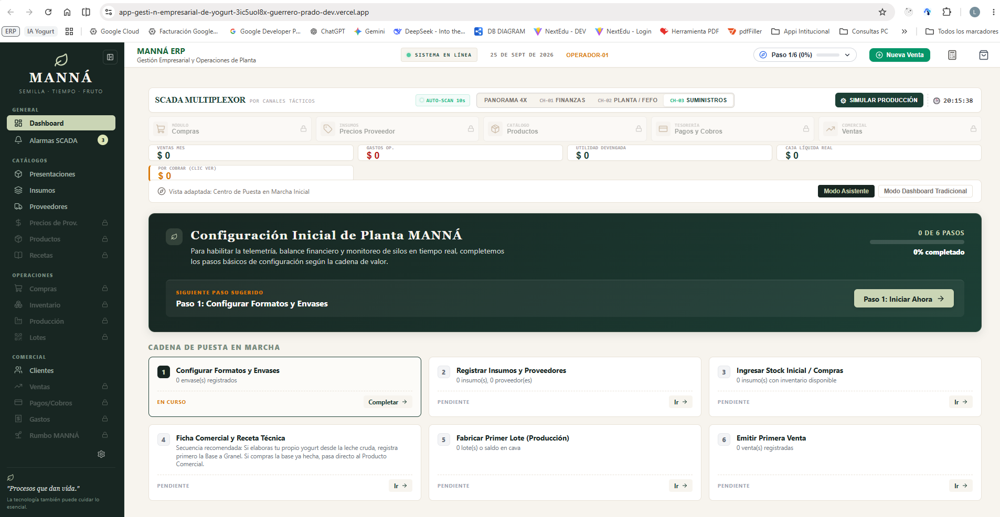
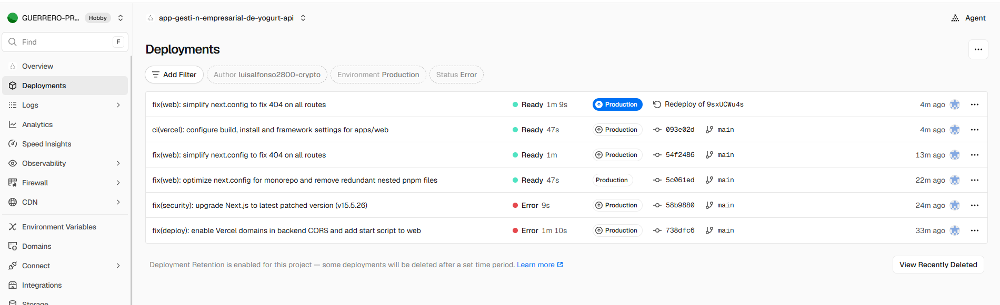
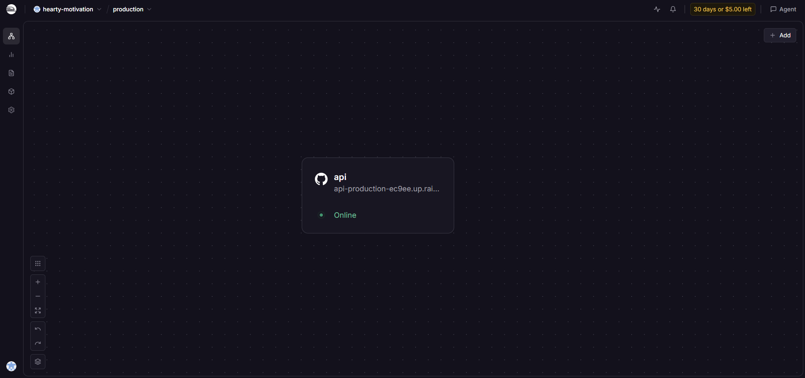
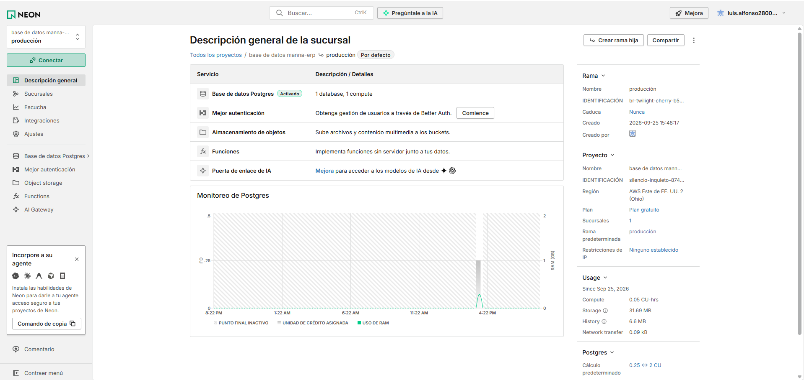
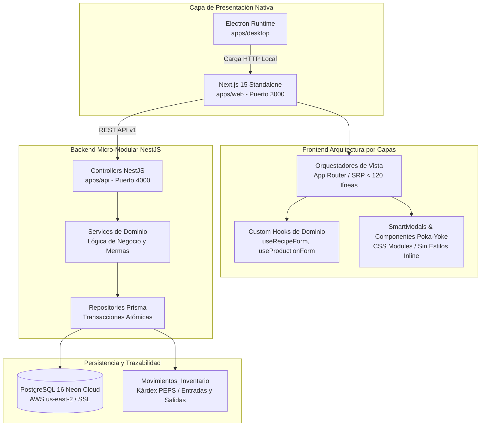

# ERP Industrial MANNÁ — Sistema Integral de Manufactura Láctea, Trazabilidad Sanitaria y Centro de Mando Táctico

[](https://nextjs.org/)
[](https://react.dev/)
[](https://nestjs.com/)
[](https://www.prisma.io/)
[](https://neon.tech/)
[](https://www.electronjs.org/)
[](https://playwright.dev/)

> **ERP Vertical de Grado Alimentario (BPM / INVIMA)** nacido para digitalizar y operar integralmente la planta de **Lácteos MANNÁ**, empresa familiar real en Santa Marta, Colombia. Reemplazó por completo la dispersión operativa de hojas de cálculo de Excel y registros manuales en papel por un sistema transaccional en la nube con trazabilidad sanitaria por lote, costeo dinámico en caliente, balance de masa y telemetría de planta.

---

## 🔗 Demo en Vivo (Producción)

**Stack desplegado en la nube:**
- 🎨 **Frontend Web:** [app-gesti-n-empresarial-de-yogurt-a.vercel.app](https://app-gesti-n-empresarial-de-yogurt-a.vercel.app) — Vercel
- ⚙️ **Backend API:** [api-production-ec9ee.up.railway.app/api/v1](https://api-production-ec9ee.up.railway.app/api/v1) — Railway
- 💾 **Base de Datos:** PostgreSQL 16 serverless en Neon Cloud (AWS `us-east-2`, SSL estricto y connection pooling)

---

## 📸 Vista Previa del Sistema

### Centro de Mando SCADA (Dashboard Principal)


### Infraestructura y Despliegue

| Frontend (Vercel) | Backend (Railway) | Database (Neon) |
|:---:|:---:|:---:|
|  |  |  |

---

## 🚀 Distribución y Modalidades de Acceso

El sistema cuenta con dos vías de acceso y distribución:

1. **🌐 Aplicación Web (Recomendado):**  
   Demo en vivo y en producción desplegada en la nube:  
   👉 **[Acceder a la Plataforma Web en Vercel](https://app-gesti-n-empresarial-de-yogurt-a.vercel.app)**

2. **📦 Aplicación de Escritorio (Windows 64-bit):**  
   Instalador `.exe` nativo disponible en la sección de **Releases** de este repositorio:  
   * **[Descargar MANNÁ Gestión Empresarial (Instalador .exe)](https://github.com/luisalfonso2800-crypto/App-Gesti-n-empresarial-de-Yogurt/releases/latest)**
   * **Ejecución Local Silenciosa (Sin Consolas Visibles):**  
     El sistema incluye un orquestador en segundo plano (`lanzar-manna-oculto.vbs`). Al ejecutarse, Windows levanta los servicios locales y abre la ventana nativa de Electron sin terminales emergentes en pantalla.

---

## 🎯 Desafíos Industriales que Resuelve

1. **Trazabilidad Sanitaria y Genealogía de Lotes (BPM / INVIMA):**
   * Vinculación obligatoria entre el lote padre de base láctea intermedia (`idLotePadre`) y los lotes hijos envasados comercialmente.
   * Monitoreo por etapas: temperaturas de pasteurización, curvas de fermentación y control de tiempos de maduración.

2. **Gestión de Inventario Intermedio (WIP - Work in Progress):**
   * Control desacoplado entre materia prima en bodega, tanques de maduración a granel (`A GRANEL`) y stock final en Cava de Producto Terminado.
   * Manejo de recirculación de inóculos y cepas vivas internas para siembra de lotes sucesivos sin depender de compras externas.

3. **Cálculo Real de Mermas y Rendimiento Lácteo:**
   * Motor transaccional con precisión matemática estricta (`Decimal.js`), eliminando errores de redondeo en punto flotante IEEE 754.
   * Deducción discreta para empaques indivisibles (vasos, tapas, etiquetas) mediante redondeo entero superior (`Math.ceil`) y balances continuos para masa/volumen.

4. **Ciclo Comercial y Cartera Poka-Yoke:**
   * Despacho dinámico y validación de stock disponible en Cava en tiempo real.
   * Facturación con cálculo de margen bruto en caliente, pagos parciales, liquidación total y comprobantes con máscara numérica y conversión a letras.

5. **Rumbo MANNÁ (Dirección Estratégica y Fondos de Cosecha):**
   * Motor analítico reactivo de avance y ritmo de ejecución (*pacing*) que asigna la utilidad operativa real hacia metas de inversión de planta y proyectos familiares.

---

## 🏛️ Arquitectura del Sistema

El ecosistema está estructurado como un **Monorepo gobernado con pnpm workspaces**, aplicando arquitectura limpia de tres capas en backend y componentes desacoplados de responsabilidad única (SRP) en frontend.



### Principios de Ingeniería y Calidad de Código
* **Veto Anti-Blue y Design System MANNÁ:** Paleta institucional de planta (`#182622` Bosque Profundo, `#8F704A` Trigo Tostado, `#FAF8F5` Lino), cero alertas nativas (`no-alert`) y feedback contextual perimetral.
* **Diseño Responsivo Táctil y Vista Dual (MAN-UI-002 / MAN-UI-003):** Experiencia ergonómica optimizada para planta y dispositivos móviles (Mobile-First, touch targets ≥ 40-44px, vista dual mediante tablas en escritorio y tarjetas fluidas en pantallas < 768px, filtros multicriterio con botón `X` individual y 4 KPIs interactivos superiores).
* **Backend-First y Transacciones ACID:** Toda entrada de compras, consumo de insumos en recetas o despacho comercial se ejecuta dentro de bloques `prisma.$transaction`.
* **Testing Automatizado Exhaustivo (Regla 07):** Cobertura en suites de integración API y pruebas visuales End-to-End con Playwright, garantizando flujos deterministas sin bucles de ejecución.
* **Guardián de Arquitectura Automatizado:** Script interno (`verify-srp.js`) que audita en cada commit que ningún componente o controlador exceda su límite de líneas (SRP ≤ 120-130 líneas).

---

## 📸 Módulos Principales del Sistema

| Módulo | Enfoque Operativo | Característica Técnica |
| :--- | :--- | :--- |
| **Centro de Mando (SCADA)** | Métricas en tiempo real de litros procesados, stock en Cava y telemetría de fermentación. | Canvas dinámicos de fluidos, osciloscopio y simulador táctico de producción y ganancia. |
| **Diseñador de Fórmulas (BOM)** | Formulación de recetas por etapas técnicas (tiempos, temperaturas mín/obj/máx). | Soporte multinivel (Insumos vs Semielaborados WIP) y semáforo de rentabilidad en tiempo real. |
| **Piso de Planta y Lotes** | Registro de órdenes de producción, consumos reales y liquidación a Cava. | Trazabilidad genealógica Lote Padre → Lote Hijo y congelación de snapshot inmutable de la receta. |
| **Abastecimiento y Kárdex** | Control de compras asistidas por faltantes, recepción física y costeo ponderado. | Kárdex automatizado con registro de stock anterior, nuevo y costo unitario de absorción. |
| **Ventas y Cartera** | Despacho comercial con selección de lote por caducidad (FEFO) y facturación. | Validación de existencias en Cava, abonos parciales y liquidación controlada de cuentas por cobrar. |
| **Rumbo MANNÁ** | Planificación estratégica y siembra de metas empresariales y familiares. | Cálculo reactivo de ritmo (*pacing*) contra flujo de caja y recaudos reales del ERP. |

---

## 🤖 Metodología y Orquestación de Agentes de IA

Este ERP no es producto de generación indiscriminada de código, sino de un flujo de **ingeniería asistida por agentes autónomos con gobernanza estricta (Human-in-the-Loop)**, donde el desarrollador actúa como arquitecto de sistemas, director técnico y auditor de calidad:

- **Constitución Operativa (`AGENTS.md`):** Reglas deterministas que rigen a los modelos de lenguaje sobre arquitectura, patrones de concurrencia y límites estrictos de alcance.
- **39 Reglas Maestras Modularizadas (`.agents/rules/`):** Desacople hermético entre submódulos (Backend & BD, Frontend SRP, Design System MANNÁ, Poka-Yoke en Formularios, Circuit Breaker anti-loop y Política de Consumo de Tokens).
- **Guardián de Arquitectura Automatizado (`.agents/scripts/verify-srp.js`):** Validador estático ejecutado por CLI que bloquea la integración de componentes que violen el principio de responsabilidad única o excedan el umbral de líneas.
- **Auditoría Forense y Diagnóstico RCA (Root Cause Analysis):** Cero parches cosméticos; ante cada incidencia operativa se analiza la causa raíz a nivel de base de datos o ciclo de vida de React antes de emitir un commit.

---

## 🛠️ Pila Tecnológica

| Componente | Tecnología | Detalle Técnico |
| :--- | :--- | :--- |
| **Monorepo Manager** | pnpm 10+ Workspaces | Aislamiento de paquetes y resolución determinista de dependencias |
| **Frontend Web** | Next.js 15 (App Router) | Servidor standalone optimizado para empaquetado web y desktop |
| **Biblioteca de UI** | React 19 + Lucide Icons | Componentes reactivos modularizados con CSS Modules |
| **Contenedor Desktop** | Electron 33 + electron-builder | Ventana nativa Windows con bloqueo de instancia única |
| **Backend API** | NestJS 11 + Express Runtime | Arquitectura desacoplada Controller → Service → Repository |
| **Modelado y Persistencia** | Prisma ORM 7 + PostgreSQL 16 | Esquema relacional con transacciones atómicas en Neon Cloud (SSL) |
| **Validación Numérica** | Decimal.js + Zod | Aritmética decimal de precisión fija para transacciones contables |
| **Testing Automatizado** | Playwright 1.50+ | Suites de integración API HTTP y pruebas visuales E2E |

---

## 💻 Puesta en Marcha en Desarrollo

### Prerrequisitos
* **Node.js:** `>= 20.x`
* **pnpm:** `>= 10.x`
* **PostgreSQL:** Base de datos activa (local o cloud, e.g. Neon Cloud). La cadena de conexión se configura en `apps/api/.env` como `DATABASE_URL`.

### Instalación
```bash
# 1. Clonar el repositorio
git clone https://github.com/luisalfonso2800-crypto/App-Gesti-n-empresarial-de-Yogurt.git
cd App-Gesti-n-empresarial-de-Yogurt

# 2. Instalar dependencias del monorepo
pnpm install

# 3. Generar cliente Prisma y compilar API
pnpm --filter api exec prisma generate
pnpm --filter api build

# 4. Iniciar servidores de desarrollo concurrentes
pnpm run dev
```

* **Frontend Web:** `http://localhost:3000`
* **Backend API Gateway:** `http://localhost:4000/api/v1`

---

## 🧪 Verificación y Suites de Pruebas
 
```bash
# Auditoría de responsabilidad única (Guardián SRP en frontend y backend)
node .agents/scripts/verify-srp.js
```

> [!NOTE]
> **Estado de las Suites Automatizadas E2E y de Integración:**  
> Las suites de pruebas End-to-End (`Playwright`) y pruebas de integración de API se encuentran **temporalmente en remediación/actualización** en este ciclo.  
> **Motivo:** Con la modernización e implementación del estándar **MAN-UI-002 / MAN-UI-003** (arquitectura de 3 capas, vista dual móvil/desktop, filtros con botones `X` individuales, modales Poka-Yoke con `SmartModal` y eliminación de alerts nativos), las interfaces cambiaron su estructura DOM y selectores. La plataforma es **100% funcional y compila limpiamente en producción**, pero los tests automatizados antiguos están siendo actualizados módulo a módulo para reflejar los nuevos componentes ergonómicos sin consumir cuotas innecesarias.

```bash
# Integración API (sin navegador - ejecución ultrarrápida de contratos)
pnpm --filter web test:e2e e2e/recipes/recipes-api-integration.spec.js
pnpm --filter web test:e2e e2e/production/production-api-integration.spec.js
pnpm --filter web test:e2e e2e/purchases/purchases-api-integration.spec.js
pnpm --filter web test:e2e e2e/payments/payments-api-integration.spec.js
pnpm --filter web test:e2e e2e/expenses/expenses-api-integration.spec.js
pnpm --filter web test:e2e e2e/goals/goals-api-integration.spec.js

# Flujos Visuales End-to-End (Happy Path en UI y modales Poka-Yoke)
pnpm --filter web test:e2e e2e/recipes/recipes-happy-path.spec.js
pnpm --filter web test:e2e e2e/production/production-happy-path.spec.js
pnpm --filter web test:e2e e2e/purchases/purchases-flow.spec.js
pnpm --filter web test:e2e e2e/sales/sales-flow.spec.js
pnpm --filter web test:e2e e2e/payments/payments-flow.spec.js
pnpm --filter web test:e2e e2e/expenses/expenses-flow.spec.js
pnpm --filter web test:e2e e2e/goals/goals-flow.spec.js

# Cobertura Exhaustiva de Cadena de Valor (E2E Completo)
pnpm --filter web test:e2e e2e/exhaustive/operations-01-purchases-production.spec.js
pnpm --filter web test:e2e e2e/exhaustive/commercial-01-orders-shipments.spec.js
pnpm --filter web test:e2e e2e/value-chain-complete.spec.js
```

---

## 🗺️ Roadmap V2 (Visión de Producto y Escalabilidad)

- [ ] **Multi-Tenancy y Aislamiento por Organización:** Soporte para múltiples microplantas lácteas y marcas productoras con Row-Level Security (RLS) en PostgreSQL.
- [ ] **Telemetría e Integración IoT en Planta:** Sensores industriales ESP32 / Modbus en marmitas y cuartos fríos para captura continua de temperatura y pH en tiempo real hacia el SCADA.
- [ ] **Planificador Predictivo de Compras Asistido por IA:** Modelos de series de tiempo para estimación de demanda estacional y compras automáticas de leche fresca basadas en la merma histórica.
- [ ] **PWA Offline-First para Despacho Rural:** Sincronización en segundo plano para preventistas y repartidores en zonas de cobertura celular intermitente.

---

## 👨‍💻 Sobre el Desarrollador

**Luis Alfonso Guerrero**  
*AI-Assisted Product Builder & Systems Architect* — Santa Marta, Colombia

Mi camino a la ingeniería de software no vino de la academia, sino del trabajo real: construcción, diseño 3D y la necesidad de resolver problemas concretos. Esos oficios me enseñaron a **medir con precisión antes de cortar** y a **diseñar herramientas que resistan el uso real de la gente**. Hoy aplico esa misma disciplina al desarrollo de software.

**¿Qué hago exactamente?** Diseño, orquesto y despliego sistemas completos.

En la construcción, el arquitecto que calcula cargas estructurales y supervisa planos no pega físicamente cada ladrillo — pero la casa se sostiene o se cae por su criterio. En el desarrollo de software con IA ocurre lo mismo:

- **La IA no sabe qué construir:** El modelo de negocio lácteo (trazabilidad INVIMA, formulación BOM/WIP, precisión decimal con `Decimal.js`) salió de mi cabeza y de las necesidades operativas de Lácteos MANNÁ.
- **La IA no tiene criterio de ingeniería:** La constitución operativa (`AGENTS.md`), las 39 reglas modulares (`.agents/rules/`), el guardián de responsabilidad única (`verify-srp.js`) y las suites de Playwright fueron diseñados por mí.
- **La IA no resuelve infraestructura:** El monorepo pnpm, la sincronización con Prisma, la base de datos Neon Cloud bajo SSL, los despliegues en Vercel y Railway, y el binario `.exe` de Electron — todo eso lo orquesté yo.

**La IA es la herramienta de ejecución; yo soy el constructor.** Estructuro datos, gobierno flujos transaccionales ACID y llevo productos complejos a producción. Ahora busco mi primer rol formal donde pueda aportar esta capacidad de ejecución y seguir aprendiendo junto a un equipo con experiencia.

- 📱 **Teléfono / WhatsApp:** [+57 333 619 3281](https://wa.me/573336193281)
- 💼 **LinkedIn:** [linkedin.com/in/luisguerrero-dev](https://www.linkedin.com/in/luisguerrero-dev)
- 🐙 **GitHub:** [@luisalfonso2800-crypto](https://github.com/luisalfonso2800-crypto)
- 📧 **Correo:** luisalfonso2800@gmail.com

---

## 📄 Licencia

Desarrollado para **Lácteos MANNÁ**. Código abierto para propósitos de demostración técnica y evaluación de arquitectura.
