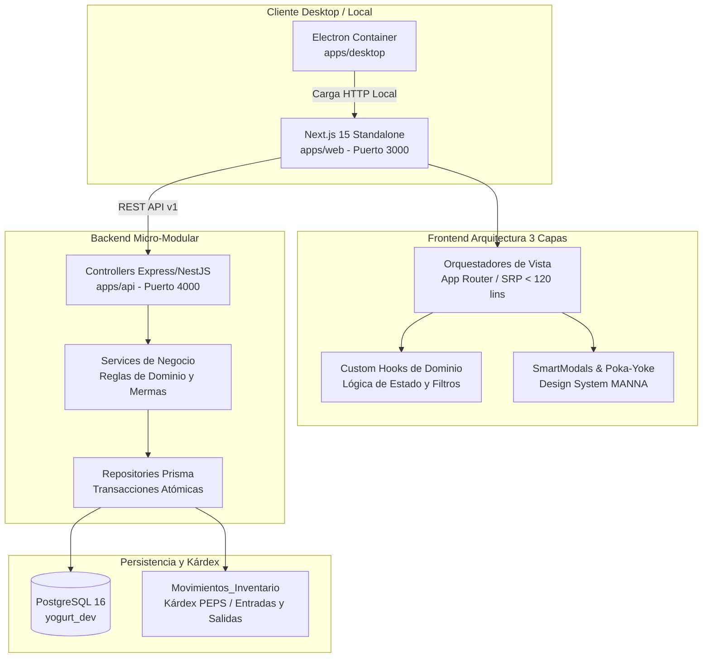

# ERP Industrial MANNÁ — Sistema Integral de Manufactura Láctea y Trazabilidad Sanitaria

[](https://nextjs.org/)
[](https://react.dev/)
[](https://nestjs.com/)
[](https://www.prisma.io/)
[](https://www.postgresql.org/)
[](https://www.electronjs.org/)
[](https://playwright.dev/)

> **ERP Vertical Especializado de Grado Alimentario (BPM / INVIMA)** diseñado con ergonomía de planta para la gestión técnica, operativa, comercial y estratégica en la elaboración y comercialización de yogurt artesanal e industrial.

---

## 🚀 Descarga y Ejecución en Windows (.exe)

El instalador compilado para Windows de 64 bits se encuentra disponible en la pestaña de **Releases** de este repositorio:

* 📦 **[Descargar MANNÁ Gestión Empresarial (Instalador .exe)](https://github.com/luisalfonso2800-crypto/App-Gesti-n-empresarial-de-Yogurt/releases)**
* **Ejecución Local Rápida (Sin Terminales Visibles):**
  Hacer doble clic en `lanzar-manna-oculto.vbs` o en el acceso directo del Escritorio. Windows levantará los microservicios en segundo plano y abrirá directamente la ventana nativa de Electron sin consolas emergentes.

---

## 🎯 Problema Industrial que Resuelve

1. **Trazabilidad Sanitaria de Lote a Lote (BPM / INVIMA):**
   * Vinculación obligatoria de lotes de insumos perecederos (leche cruda, cultivos lácticos, fruta procesada) con el lote final envasado.
   * Auditoría de temperaturas de pasteurización, tiempos de incubación y curvas de fermentación.

2. **Gestión de Inventario Intermedio (WIP - Work in Progress):**
   * Control preciso de tanques de incubación e inventario en proceso antes del saborizado, corte de cuajada y envasado.
   * Separación física y lógica entre inventario de materia prima, producto en fermentación y Cava de Producto Terminado (P.T.).

3. **Cálculo de Mermas y Rendimiento Real vs. Teórico:**
   * Motor financiero basado en `Decimal.js` con precisión matemática estricta (cero redondeos flotantes IEEE 754).
   * Monitoreo de mermas por evaporación, restos en tubería/tanque y porcentaje de merma en empaque.

4. **Ciclo Comercial y Cartera Poka-Yoke:**
   * Despacho dinámico y liquidación desde Cava con validación de stock disponible en tiempo real.
   * Facturación con cuentas por cobrar, abonos parciales, liquidación total y emisión de comprobantes.

5. **Rumbo MANNÁ (Dirección Estratégica y Fondos de Cosecha):**
   * Panel de asignación de utilidades operativas reales para metas de expansión industrial y proyectos de bienestar familiar.

---

## 🏛️ Arquitectura del Sistema

El ecosistema está estructurado como un **Monorepo gobernado con pnpm workspaces**, aplicando arquitectura limpia de tres capas en backend y componentes de responsabilidad única (SRP) en frontend.



### Principios de Gobernanza y Calidad
* **Veto Anti-Blue y Design System MANNÁ:** Paleta institucional de planta (`#182622` Bosque Profundo, `#8F704A` Trigo Tostado, `#F6F4EB` Pergamino), botones accesibles, sin alertas nativas intrusivas (`no-alert`).
* **Backend-First y Transacciones ACID:** Toda entrada de insumos, descuento de lote o despacho comercial se procesa en bloques `prisma.$transaction`.
* **Testing Automatizado (Regla 07):** 100% de cobertura en integración API y Happy Path visual Playwright sin bucles ni dependencias de digitación manual.

---

## 📸 Galería Visual del Sistema

### 1. Panel de Control y Telemetría Operativa (Dashboard)
> Métricas en tiempo real de producción semanal, litros en fermentación, valorización de inventario en bodega y stock en Cava de Producto Terminado.
```
┌────────────────────────────────────────────────────────────────────────┐
│  MANNÁ — Panel de Control Industrial                       [Cifras: ON]│
│  [ Producción: 1.250 L ]  [ En Cava: 840 U ]  [ Cartera: $ 4.250.000 ] │
│  ────────────────────────────────────────────────────────────────────  │
│  ► Tanque 1: Fermentación (42°C - 3h 15m)   ███████████░░ 78%          │
│  ► Tanque 2: Pasteurizado (85°C - Terminado) ████████████ 100%         │
└────────────────────────────────────────────────────────────────────────┘
```

### 2. Diseñador de Fórmulas y Explosión de Materiales (BOM)
> Configuración de recetas maestro-detalle con rendimientos porcentuales, densidad de insumos y parámetros críticos de temperatura y tiempo.

### 3. Cierre de Lote y Liquidación a Cava con Control de Mermas
> Conciliación entre volumen inicial procesado, unidades finales envasadas y cálculo automático de costo unitario por presentación comercial.

### 4. Ciclo de Despacho Comercial y Recaudo de Cartera
> Bitácora de ventas directas y a crédito, emisión de comprobantes y módulo de abonos con máscara Poka-Yoke y conversión a letras.

### 5. Rumbo MANNÁ — Asignación de Utilidades y Metas
> Seguimiento visual de fondos disponibles para reinversión de planta y proyectos familiares a partir de la utilidad neta auditada.

---

## 🛠️ Pila Tecnológica

| Componente | Tecnología | Propósito |
| :--- | :--- | :--- |
| **Monorepo Manager** | pnpm 11 Workspaces | Gestión hermética de dependencias y scripts cruzados |
| **Frontend Web** | Next.js 15 (App Router, Standalone) | Interfaz visual ergonómica para operadores y gerencia |
| **Biblioteca UI** | React 19 + Lucide Icons + CSS Modules | Componentes reactivos modulares con cero estilos inline |
| **Contenedor Desktop** | Electron 33 + electron-builder | Ejecución nativa para Windows con soporte offline local |
| **Backend API** | NestJS 11 + Express | API Gateway modular, autenticación y validación de esquemas |
| **Validación de Datos** | Zod + Decimal.js | Contratos de payload estrictos y aritmética decimal exacta |
| **Capa de Persistencia** | Prisma ORM 7 + PostgreSQL 16 | Modelado relacional, migraciones y transacciones atómicas |
| **Testing Automatizado** | Playwright 1.63 + Jest 29 | Pruebas de integración API HTTP y verificación visual E2E |

---

## 💻 Instalación y Desarrollo Local

### Requisitos Previos
* **Node.js:** `>= 20.x`
* **pnpm:** `>= 10.x`
* **PostgreSQL:** Base de datos activa configurada en `apps/api/.env` (`DATABASE_URL`).

### Pasos de Configuración
```bash
# 1. Clonar el repositorio
git clone https://github.com/luisalfonso2800-crypto/App-Gesti-n-empresarial-de-Yogurt.git
cd App-Gesti-n-empresarial-de-Yogurt

# 2. Instalar dependencias del monorepo
pnpm install

# 3. Generar el cliente Prisma y sincronizar base de datos
pnpm --filter api build

# 4. Iniciar entorno de desarrollo completo (Backend + Frontend)
pnpm run dev
```

* Backend disponible en: `http://localhost:4000/api/v1`
* Frontend disponible en: `http://localhost:3000`

---

## 🧪 Ejecución de Pruebas Automatizadas

```bash
# Validar integración arquitectural de componentes frontend (SRP < 120 líneas)
pnpm run verify:srp

# Ejecutar suites completas de integración API (sin navegador)
pnpm --filter web test:e2e e2e/expenses/expenses-api-integration.spec.js
pnpm --filter web test:e2e e2e/goals/goals-api-integration.spec.js
pnpm --filter web test:e2e e2e/payments/payments-api-integration.spec.js
pnpm --filter web test:e2e e2e/purchases/purchases-api-integration.spec.js

# Ejecutar suites de flujo visual E2E representativo (Happy Path)
pnpm --filter web test:e2e e2e/expenses/expenses-flow.spec.js
pnpm --filter web test:e2e e2e/goals/goals-flow.spec.js
pnpm --filter web test:e2e e2e/payments/payments-flow.spec.js
pnpm --filter web test:e2e e2e/purchases/purchases-flow.spec.js
pnpm --filter web test:e2e e2e/sales/sales-flow.spec.js
```

---

## 📄 Licencia y Propiedad Intelectual

Desarrollado para **Lácteos MANNÁ**. Todos los derechos de propiedad intelectual y formulación técnica reservados.
