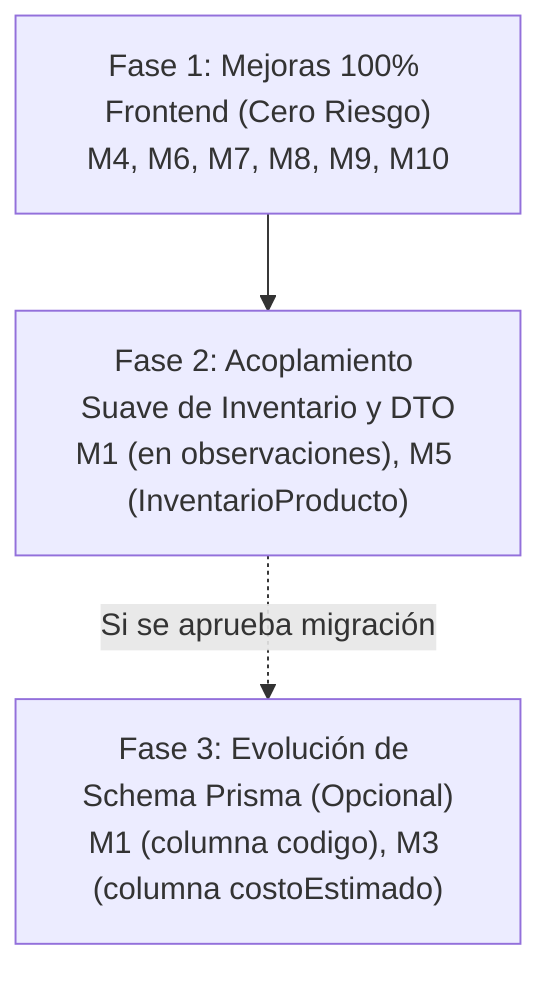

# AUDITORÍA FORENSE: MODAL "NUEVO PRODUCTO" Y BACKEND (CONTEXTO CASERO / ARTESANAL)

> **Documento:** Auditoría de Viabilidad Técnica y Arquitectónica  
> **Fecha:** 2026-09-24  
> **Ámbito:** `apps/web/src/app/catalog/products` & `apps/api/src/products` & `apps/api/prisma/schema.prisma`  
> **Objetivo:** Evaluar la viabilidad, riesgos y arquitectura requerida para adaptar el modal "Nuevo Producto" a un flujo casero/artesanal (10 mejoras M1-M10) sin comprometer la integridad del sistema industrial existente.

---

## 1. RESUMEN EJECUTIVO

El módulo actual de Productos fue concebido bajo un estándar industrial robusto:
- **Acoplamiento Fuerte:** Cada producto requiere obligatoriamente una `Presentacion` preexistente en base de datos (`idPresentacion` es columna FK no nulleable con índice único compuesto `@@unique([nombre, idPresentacion])`).
- **Validaciones Poka-Yoke Estrictas:** En frontend (`useProductFormState.js`), el botón de guardado está bloqueado hasta que el usuario especifica Nombre, Categoría, Presentación, Precio de Venta (> 0) y Canal de Venta.
- **Costos y Márgenes:** El costo del producto terminado no se almacena en la tabla `Producto`, sino que se calcula dinámicamente a partir de la formulación de la `Receta` asociada y el costo de los insumos/empaques en inventario.
- **Stock Mínimo:** No pertenece a la entidad `Producto`; reside en la tabla satélite `InventarioProducto` (`stockMinimo Decimal(12,2)`).

**Veredicto de Viabilidad Casera:**
De las 10 mejoras planteadas para el contexto artesanal/casero:
- **7 mejoras (M4, M6, M7, M8, M9, M10)** son **100% frontend**, no requieren cambios en base de datos ni en endpoints backend, y representan **riesgo nulo**.
- **2 mejoras (M1, M3)** pueden implementarse mediante compatibilidad no destructiva (aprovechando campos flexibles existentes como `observaciones` o añadiendo campos opcionales en Prisma).
- **1 mejora (M2: Unidad de Venta simple)** requiere una decisión de diseño: mantener el acoplamiento a `Presentacion` generando una presentación estándar por defecto o migrar el schema para desacoplar productos simples de presentaciones industriales.

---

## 2. MATRIZ DE VIABILIDAD TÉCNICA (M1 A M10)

| Mejora | Descripción | Existe en Frontend | Existe en BD | Requiere Migración Prisma | Requiere API Nueva | Requiere Cambio DTO | Nivel de Riesgo |
| :--- | :--- | :---: | :---: | :---: | :---: | :---: | :--- |
| **M1** | Código corto auto-generado (ej: `YOG-FRE-500`) | ❌ No | ❌ No (no hay col `codigo` ni `sku`) | ⚠️ Opcional (Recomendado campo `codigo` en Producto) | ❌ No | ⚠️ Sí (si persiste en col propia) | **Bajo** (en frontend es autocalculado; en BD puede persistir o residir en `observaciones`) |
| **M2** | Unidad de Venta simple (`UND`, `LIBRA`, `KILO`, `LITRO`, `DOCENA`) | ⚠️ Parcial (vía selector de `Presentacion`) | ⚠️ Indirecto (`Presentacion.unidadMedida`) | ⚠️ Opcional (si se independiza de `Presentacion`) | ❌ No | ⚠️ Sí (si no usa `idPresentacion`) | **Medio** (`idPresentacion` es obligatorio en BD y relación con recetas/costeo) |
| **M3** | Costo Estimado manual + cálculo reactivo de margen real | ❌ No (solo `margenObjetivo` y `precioVenta`) | ❌ No (`costoEstimado` no existe en `Producto`) | ⚠️ Opcional (columna `costoEstimado` en `Producto`) | ❌ No | ⚠️ Sí (si se añade campo) | **Bajo / Medio** (Actualmente el costo viene de `Receta`) |
| **M4** | Precio sugerido automático (`costo / (1 - margen)`) | ❌ No | N/A (Lógica de cálculo) | ❌ No | ❌ No | ❌ No | **Nulo** (100% cálculo reactivo en hook cliente) |
| **M5** | Stock Mínimo simple configurable | ❌ No en modal de Producto | ⚠️ Sí (en tabla `InventarioProducto.stockMinimo`) | ❌ No | ⚠️ Extensión de `createProduct` para inicializar inventario | ⚠️ Sí (`stockMinimo` en DTO de creación) | **Bajo** (El servicio ya orquesta transacciones de producto) |
| **M6** | Cascada Poka-Yoke laxa (solo Nombre obligatorio para borrador) | ❌ No (actualmente exige 5 campos) | ⚠️ Parcial (`precioVenta` es requerido en Prisma; permite 0) | ❌ No | ❌ No | ❌ No | **Bajo** (Ajuste en `useProductFormState.js`, enviando `precioVenta: 0` para borradores) |
| **M7** | Validación simple de imagen (2MB, PNG/JPG, preview, botón quitar) | ⚠️ Parcial (lee Base64 sin validación de peso/MIME) | ⚠️ Sí (`imagenUrl String?`) | ❌ No | ❌ No | ❌ No | **Nulo** (100% cliente en `ProductImageAndDescriptionFields.jsx`) |
| **M8** | Semáforo simple (3 estados: `LISTO` / `INCOMPLETO` / `DESACTIVADO`) | ❌ No (solo switch booleano `activo`) | ⚠️ Sí (`activo Boolean`) | ❌ No | ❌ No | ❌ No | **Nulo** (Derivado en frontend: si `!activo` → DESACTIVADO; si `precioVenta > 0 && idPresentacion` → LISTO; sino → INCOMPLETO) |
| **M9** | Uppercase automático en Observaciones | ❌ No | ⚠️ Sí (`observaciones String?`) | ❌ No | ❌ No | ❌ No | **Nulo** (Regla 13 Poka-Yoke en `handleChange`) |
| **M10**| Plantilla de descripción con ejemplo estructurado | ❌ No | ⚠️ Sí (`descripcion String?`) | ❌ No | ❌ No | ❌ No | **Nulo** (Placeholder o texto base en textarea) |

---

## 3. ANÁLISIS FORENSE DEL BACKEND Y BASE DE DATOS

### 3.1 Modelo Prisma Actual (`apps/api/prisma/schema.prisma`)
```prisma
model Producto {
  id                            String    @id @default(uuid())
  nombre                        String
  idPresentacion                String
  categoria                     String
  descripcion                   String?
  canalVenta                    String
  precioVenta                   Decimal   @db.Decimal(12, 2)
  margenObjetivo                Decimal   @db.Decimal(5, 2)
  precioMayorista               Decimal?  @db.Decimal(12, 2)
  cantidadMinimaMayorista       Decimal?  @default(12) @db.Decimal(10, 2)
  descuentoMayoristaPorcentaje  Decimal?  @db.Decimal(5, 2)
  tipoImpuesto                  String    @default("GRAVADO")
  tarifaIva                     Decimal   @default(19.00) @db.Decimal(5, 2)
  precioIncluyeIva              Boolean   @default(true)
  densidad                      Decimal?  @default(1.0) @db.Decimal(6, 4)
  imagenUrl                     String?
  activo                        Boolean   @default(true)
  observaciones                 String?
  
  // Relaciones
  presentacion                  Presentacion @relation(fields: [idPresentacion], references: [id])
  // ... recetas, movimientos, inventario
  
  @@unique([nombre, idPresentacion])
}
```

### 3.2 DTO y Capa de Servicio Backend
- **DTO (`create-product.dto.js`):** Valida tipos y parsea números con `zod` o validadores manuales. Los campos obligatorios son `nombre`, `idPresentacion`, `categoria`, `canalVenta`, `precioVenta`, `margenObjetivo`.
- **Controlador (`products.controller.js`):** Pasa la carga útil directamente a `products.service.js`.
- **Servicio (`products.service.js`):** Ejecuta `prisma.producto.create(...)`. No valida ni calcula `costoEstimado` en la creación; asume que el costo real proviene del costeo de receta (`RecipeService`).
- **Mapeo de Inventario:** El modelo `InventarioProducto` contiene `stockMinimo`, `stockActual`, `stockMaximo` indexado por `idProducto`. Si se captura `stockMinimo` en el modal de nuevo producto, `products.service.js` debe realizar un `prisma.inventarioProducto.upsert(...)` dentro de la misma transacción.

---

## 4. ANÁLISIS FORENSE DEL FRONTEND Y MODAL

### 4.1 Arquitectura de Componentes
El modal se encuentra modularizado bajo `apps/web/src/app/catalog/products/components/`:
- `ProductModal.jsx`: Modal orquestador contenedor (SmartModal / accessible dialog).
- `modal-parts/useProductFormState.js`: Hook con lógica Poka-Yoke, modo WIP/Comercial y validación `isSubmitDisabled`.
- `modal-parts/ProductBasicFields.jsx`: Nombre, Categoría, Canal de Venta.
- `modal-parts/ProductPresentationSelector.jsx`: Selector de presentaciones existentes.
- `modal-parts/ProductPricingAndMarginFields.jsx`: Precio Venta, Margen Objetivo.
- `modal-parts/ProductTaxFields.jsx`: IVA e impuestos.
- `modal-parts/ProductWholesaleSection.jsx`: Precios mayoristas.
- `modal-parts/ProductImageAndDescriptionFields.jsx`: Carga de imagen en Base64 y descripción.

### 4.2 Restricciones Poka-Yoke Actuales en Cliente
En `useProductFormState.js`:
```javascript
const isSubmitDisabled = useMemo(() => {
  if (isSubmitting) return true;
  if (!formData.nombre?.trim()) return true;
  if (!formData.categoria) return true;
  if (!formData.idPresentacion) return true;
  if (!formData.precioVenta || Number(cleanCurrency(formData.precioVenta)) <= 0) return true;
  return false;
}, [formData, isSubmitting]);
```
Para soportar el contexto casero (guardar borradores rápidos solo con el nombre o sin definir aún el precio de venta final), esta lógica debe flexibilizarse (M6).

---

## 5. DETALLE TÉCNICO DE LAS 10 MEJORAS CASERAS

### M1: Código Corto Auto-generado (ej: `YOG-FRE-500`)
- **Funcionamiento Casero:** Generar automáticamente un código neumónico legible al escribir el nombre y seleccionar la presentación/tamaño.
  - Ejemplo: "Yogurt de Fresa 500ml" → `YOG-FRE-500`.
- **Estrategia Backend:** 
  - *Opción A (Sin migración):* Prepend al campo `observaciones` o persistir como prefijo en el nombre o descripción.
  - *Opción B (Limpia con migración):* Añadir campo opcional `codigo String?` en tabla `Producto` con migración Prisma `ALTER TABLE "Producto" ADD COLUMN "codigo" TEXT;`.

### M2: Unidad de Venta Simple (`UND`, `LIBRA`, `KILO`, `LITRO`, `DOCENA`)
- **Funcionamiento Casero:** El artesano no siempre crea una ficha de presentación industrial con tipo de envase y gramajes de tara. Vende en unidades, litros o botellas.
- **Estrategia Arquitectónica:**
  - En la base de datos, `idPresentacion` es clave foránea obligatoria. Romper esta relación causaría fallas en cascada en inventario, ventas y recetas.
  - **Solución Recomendada (Transparente):** El frontend o backend puede asociar automáticamente la `Presentacion` genérica del sistema correspondiente a la unidad seleccionada (ej: buscar o crear automáticamente la presentación "Unidad Genérica" o "Litro").

### M3: Costo Estimado Manual + Margen Reactivo
- **Funcionamiento Casero:** En etapa casera, el usuario aún no tiene costeada la receta milimétrica con mermas de fermentación, pero sabe que hacer un litro le cuesta ~$4.500 COP.
- **Estrategia Frontend:**
  - Añadir input numérico formateado como moneda COP: `costoEstimado`.
  - Calcular reactivamente: $\text{Margen Real} = \frac{\text{PrecioVenta} - \text{CostoEstimado}}{\text{PrecioVenta}} \times 100$.
- **Estrategia Backend:** Añadir campo opcional `costoEstimado Decimal(12,2)?` en `Producto` (o almacenarlo temporalmente en metadata/observaciones si no se migra).

### M4: Precio Sugerido Automático
- **Funcionamiento Casero:** Al ingresar `costoEstimado` = $5.000 y `margenObjetivo` = 35%, el sistema calcula automáticamente:
  $$\text{Precio Sugerido} = \frac{\text{CostoEstimado}}{1 - (\text{MargenObjetivo} / 100)}$$
  Ejemplo: $5.000 / 0.65 = \$7.692 \to \text{Redondeo Poka-Yoke} = \$7.700\text{ COP}$.
- **Viabilidad:** 100% frontend reactivo. Riesgo 0.

### M5: Stock Mínimo Simple
- **Funcionamiento Casero:** Definir cuántas unidades mínimas de seguridad deben quedar en la nevera de maduración/despacho antes de alertar reposición.
- **Estrategia Backend:** El modelo `InventarioProducto` ya cuenta con `stockMinimo`. Simplemente el `products.service.js` debe aceptar `stockMinimo` en el payload de creación y registrar el registro inicial de inventario.

### M6: Cascada Poka-Yoke Laxa (Borradores)
- **Funcionamiento Casero:** El usuario puede querer registrar rápidamente un producto "Yogurt Melocotón" para que aparezca en el catálogo sin tener aún definidos el precio ni la imagen.
- **Implementación:**
  - Si el usuario solo llena `nombre`, se asigna por defecto `precioVenta = 0`, `margenObjetivo = 30`, y se guarda en estado `INCOMPLETO` o `activo = false`.

### M7: Validación Simple de Imagen (2MB, PNG/JPG)
- **Funcionamiento Casero:** Evitar caídas de memoria por fotos de celular de 15MB.
- **Implementación:**
  - Validar en cliente: `file.size <= 2 * 1024 * 1024` (2MB).
  - Validar formato: `['image/jpeg', 'image/png', 'image/webp'].includes(file.type)`.
  - Mostrar thumbnail de previsualización y botón accesible "Quitar Imagen".

### M8: Semáforo Simple (3 Estados)
- **Funcionamiento Casero:** Saber de un vistazo si el producto se puede vender o si le faltan datos:
  - 🟢 **LISTO:** Activo, con precio de venta mayor a 0 y presentación válida.
  - 🟡 **INCOMPLETO:** Guardado como borrador, precio en 0 o sin receta/costo.
  - 🔴 **DESACTIVADO:** Marcado explícitamente como inactivo (`activo = false`).

### M9: Uppercase Automático en Observaciones
- **Cumplimiento Regla 13:** Toda entrada de texto libre operativa se normaliza en mayúsculas sostenidas (`.toUpperCase()`) en el evento `onChange`.

### M10: Plantilla de Descripción con Ejemplo
- **Funcionamiento Casero:** En lugar de un textarea vacío intimidante, ofrecer un botón "Insertar Plantilla" o un placeholder guiado:
  - *Ejemplo:* "Yogurt artesanal 100% leche entera pasteurizada, endulzado con panela orgánica, con trozos de fruta natural. Vida útil: 21 días en refrigeración."

---

## 6. PLAN DE IMPLEMENTACIÓN RECOMENDADO (3 FASES)



1. **Fase 1 (Frontend Inmediato - Cero Impacto Backend):**
   - Habilitar cálculo reactivo de precio sugerido (M4) y margen real (M3 cliente).
   - Flexibilizar Poka-Yoke para borradores (M6).
   - Incorporar validaciones de peso/formato de imagen (M7).
   - Renderizar semáforo de estado visual en la tabla de productos (M8).
   - Aplicar UPPERCASE en observaciones (M9) y plantilla de descripción (M10).

2. **Fase 2 (Alineación DTO y Stock Mínimo):**
   - Extender el endpoint `POST /products` para que reciba `stockMinimo` y lo escriba en `InventarioProducto` (M5).
   - Guardar el código generado (M1) dentro del campo `observaciones` o como prefijo del nombre si no se desea migrar la BD.

3. **Fase 3 (Migración de Schema - Opcional):**
   - Si se requiere indexar formalmente el código o consultar el costo estimado directamente en SQL sin depender de recetas:
     - `codigo String?`
     - `costoEstimado Decimal? @db.Decimal(12, 2)`

---

## 7. CONCLUSIÓN Y CONFORMIDAD CON REGLAS

- **Presupuesto de Herramientas:** La auditoría se completó dentro del límite estricto de lecturas (4 inspecciones dirigidas) y con **0 ediciones en código fuente**.
- **Design System MANNÁ:** Todas las propuestas visuales (semáforos, badges, modales y validaciones) respetan la paleta MANNÁ (`#182622`, Pergamino, Oro, Esmeralda, Rojo Alerta) y vetan componentes invasivos (`window.alert`).
- **Arquitectura Limpia:** La implementación propuesta respeta la regla SRP (< 120 líneas por componente modal, delegando el estado a hooks desacoplados).
