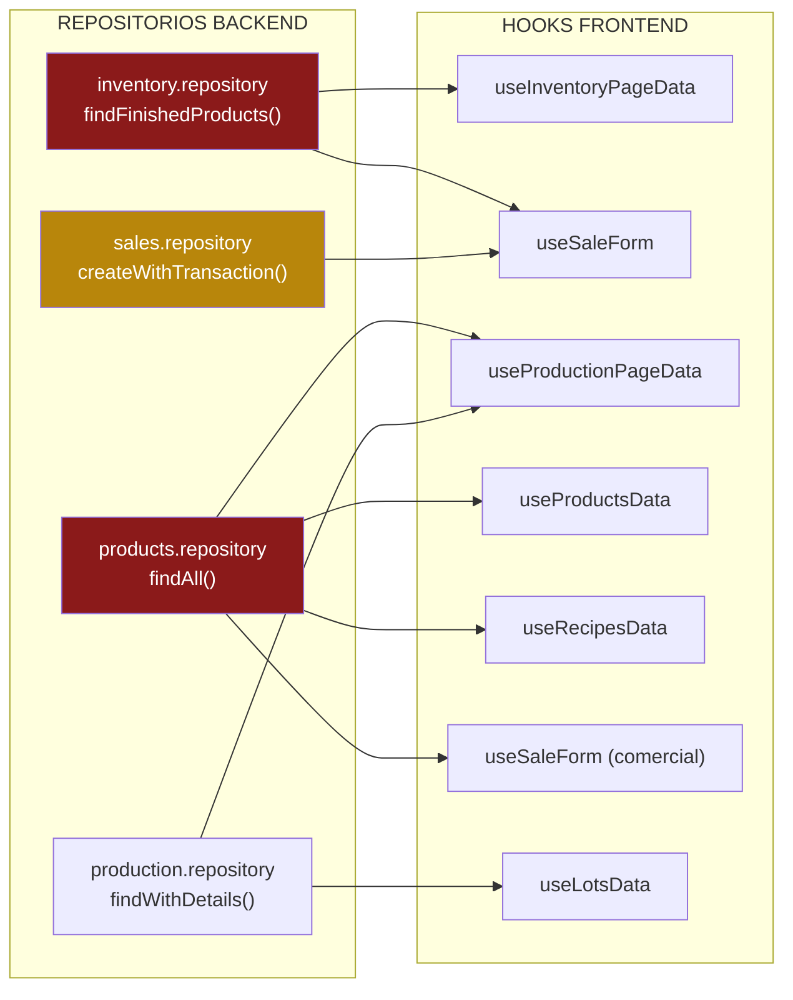

# INFORME DE AUDITORÍA TÉCNICA INTEGRAL
## Dependencias, Acoplamiento y Análisis Causa-Raíz

**Proyecto:** Yogurt ERP — Sistema de Gestión Empresarial de Yogurt
**Tipo:** Auditoría de solo lectura — sin modificaciones al código fuente
**Fecha:** 2026-09-20
**Auditor:** Antigravity AI (Audit Prompt #506)
**Metodología:** Barrido en 4 fases paralelas (Fases 1–4)
**Estado:** `COMPLETADO`

---

## 1. RESUMEN EJECUTIVO

### Diagnóstico Central: ¿Por qué el sistema es frágil?

El sistema sufre de **acoplamiento implícito por contratos de datos no formalizados**. El fenómeno de "arreglar A rompe B" ocurre porque:

1. **Los repositorios backend son multipropósito**: Un solo método como `findFinishedProducts` en `inventory.repository.js` sirve simultáneamente al panel de inventario operacional, al selector de productos en el modal de ventas (`SaleCavaCatalogDrawer`) y al hook de producción. Cuando se modifica su `include` o su `where`, todos los consumidores cambian su forma de datos recibidos sin que haya un contrato explícito que los proteja.

2. **Los campos del schema Prisma no coinciden con los campos que el frontend consume**: El frontend accede a propiedades como `costoEstandar`, `volumenOzMl`, `capacidad` y `unidadMedida` que **no existen en el schema de Prisma**. El schema real usa `cantidadOz`, `cantidadMl`, `unidadBase`. Esta brecha hace que cualquier ajuste de include o alias de campo en el backend se propague silenciosamente como `undefined` en la UI, rompiendo cálculos de costos, inventario y precios.

3. **La lógica de negocio crítica vive en el frontend**: Cálculos de márgenes, IVA, conversiones de unidades y rendimientos de receta están implementados en hooks de React. Esto significa que la misma fórmula existe en múltiples lugares con variantes sutiles, y que una refactorización de la API puede invalidarlos sin lanzar errores de compilación.

4. **`/dashboard/page.jsx` tiene 1.050 líneas** (límite SRP: 120). Es una "God Page" que gestiona múltiples estados, modales, simulaciones y vistas. Cualquier cambio de contexto o endpoint que consuma afecta directamente todo el dashboard.

---

## 2. INVENTARIO COMPLETO DEL SISTEMA

### 2.1 Tabla de Módulos Frontend

| Ruta | Archivo Principal | Líneas | Hooks Principales | Modales que Abre |
|------|------------------|--------|-------------------|------------------|
| `/` (redirect) | `app/page.jsx` | 6 | — | — |
| `/dashboard` | `app/dashboard/page.jsx` | **1.050** 🔴 | `useOnboardingStatus`, `useState`, `useEffect`, `useMemo`, `useRef` | `SmartModal` (múltiples instancias), `SimulationDrawer` |
| `/catalog/presentations` | `app/catalog/presentations/page.jsx` | 94 | `usePresentationsData`, `usePresentationForm` | `PresentationModal`, `ConfirmDeletePresentationModal` |
| `/catalog/products` | `app/catalog/products/page.jsx` | 86 | `useProductsPageManager`, `useProductDeleteManager`, `useBulkProductsActions` | `ProductsModal` |
| `/catalog/recipes` | `app/catalog/recipes/page.jsx` | 91 | `useRecipesPageManager` | `RecipeModal` |
| `/catalog/supplier-prices` | `app/catalog/supplier-prices/page.jsx` | 118 | `useSupplierPricesData`, `useCartManager` | `SupplierPriceModal`, `MoveListModal` |
| `/catalog/suppliers` | `app/catalog/suppliers/page.jsx` | 36 | `useSuppliersData`, `useSupplierForm` | `SupplierModal` |
| `/catalog/supplies` | `app/catalog/supplies/page.jsx` | 109 | `useSuppliesData`, `useSupplyForm` | `SupplyModal`, `ConfirmDeleteModal` |
| `/commercial/clients` | `app/commercial/clients/page.jsx` | 106 | `useClientsPageData` | `ClientFormModal` |
| `/commercial/expenses` | `app/commercial/expenses/page.jsx` | 102 | `useExpensesPageData` | `ExpenseFormModal` |
| `/commercial/payments` | `app/commercial/payments/page.jsx` | 114 | `usePaymentsPageData` | `PaymentFormModal` |
| `/commercial/sales` | `app/commercial/sales/page.jsx` | 99 | `useSalesData`, `useSaleForm`, `useClientsPageData` | `SaleModal`, `SalesDispatchModal`, `SaleCavaCatalogDrawer`, `ClientFormModal` |
| `/operations/inventory` | `app/operations/inventory/page.jsx` | 104 | `useInventoryPageData` | `GlobalInventoryAdjustmentModal`, `InventoryItemAdjustmentModal` |
| `/operations/lots` | `app/operations/lots/page.jsx` | 113 | `useLotsData` | — |
| `/operations/production` | `app/operations/production/page.jsx` | 119 | `useProductionPageData` | `ProductionPlanningModal`, `ProductionOrderCompleteModal` |
| `/operations/purchases` | `app/operations/purchases/page.jsx` | 103 | `usePurchasesPageData` | `PurchasesModal` |
| `/operations/purchases/new` | `app/operations/purchases/new/page.jsx` | 85 | `usePurchaseData`, `useChecklistManager`, `usePurchaseModals`, `useFormPhaseData` | `StockLookupDrawer`, `ChecklistAddPendingModal`, `ChecklistItemRowMoveModal` |

### 2.2 Catálogo de Modales/Drawers

| Nombre | Ruta | Módulos Invocadores | Endpoints que Llama | Mutaciones | Riesgo |
|--------|------|---------------------|---------------------|------------|--------|
| `SaleModal` | `commercial/sales/components/` | Ventas | `/sales`, `/clients`, `/inventory/finished-products`, `/products?comercial=true` | `setStockError`, `setHasSubmitted` | 🔴 ALTO |
| `SaleCavaCatalogDrawer` | `commercial/sales/components/modal-parts/` | SaleModal | `/inventory/finished-products` | `setSearchTerm`, `setQuantities` | 🔴 ALTO |
| `SalesDispatchModal` | `commercial/sales/components/` | Ventas | `/sales/:id/dispatch` | Mutación de stock, lote y venta | 🔴 ALTO |
| `GlobalInventoryAdjustmentModal` | `operations/inventory/components/` | Inventario | `/inventory/adjustments` | `setIdInsumo`, `setTipo`, `setCantidad` | 🔴 ALTO |
| `InventoryItemAdjustmentModal` | `operations/inventory/components/` | Inventario | `/inventory/adjustments` | `setAdjustmentModal` | 🔴 ALTO |
| `ProductionModal` | `operations/production/components/` | Producción | `/production`, `/recipes` | `setSelectedRecipeId`, `setCantidadPlanificada` | 🔴 ALTO |
| `ProductionPlanningModal` | `operations/production/components/` | Producción | `/production` | `setSelectedRecipe`, `setQty` | 🔴 ALTO |
| `ProductionOrderCompleteModal` | `operations/production/components/` | Producción | `/production/:id/complete` | Cierre de orden, generación de lote | 🔴 ALTO |
| `ProductionIncidentModal` | `operations/production/components/` | Producción | `/production/:id/incident` | `setMotivo`, `setVolumenRescatado` | 🔴 ALTO |
| `StockLookupDrawer` | `operations/purchases/new/components/` | Compras-Nueva | `/supplies`, `/inventory` | `setSupplies`, `setLoading` | 🟡 MEDIO |
| `SupplierPriceModal` | `catalog/supplier-prices/components/` | Precios Proveedor | `/supplier-prices` | Precio actualizado | 🟡 MEDIO |
| `ClientFormModal` | `commercial/clients/components/` | Ventas, Clientes | `/clients` | Cliente creado/editado | 🟡 MEDIO |
| `SupplierModal` | `components/catalog/` | Proveedores | `/suppliers` | Proveedor creado/editado | 🟡 MEDIO |
| `SimulationDrawer` | `dashboard/components/` | Dashboard | `/dashboard/simulate-batch` | `setLoading`, `setProductoId` | 🟡 MEDIO |
| `RecipeModal` | `catalog/recipes/components/` | Recetas | `/recipes` | Receta creada/editada | 🟡 MEDIO |
| `SmartModal` | `components/ui/` | TODOS | — | `setShowConfirmClose` | 🟡 MEDIO |
| `PresentationModal` | `catalog/presentations/components/` | Presentaciones | `/presentations` | `setHasSubmitted` | 🟢 BAJO |
| `ProductModal` | `catalog/products/components/` | Productos | `/products` | — | 🟢 BAJO |
| `ConfirmDeletePresentationModal` | `catalog/presentations/components/` | Presentaciones | — | — | 🟢 BAJO |
| `PackagingWizardModal` | `catalog/recipes/components/modal-parts/` | RecipeModal | — | `setSelectedPresId`, `setAnswers` | 🟢 BAJO |
| `MoveListModal` | `catalog/supplier-prices/components/` | Precios | — | `setSelectedTargetList` | 🟢 BAJO |
| `PlantToolsModal` | `components/common/tools/` | Global (shell) | — | `setIsOpen`, `setActiveTab` | 🟢 BAJO |
| `ChecklistAddPendingModal` | `operations/purchases/new/components/` | Compras-Nueva | — | `setPendingForm` | 🟢 BAJO |
| `ChecklistItemRowMoveModal` | `operations/purchases/new/components/` | Compras-Nueva | — | `setSelectedTargetList` | 🟢 BAJO |

### 2.3 Tabla de Repositorios y Endpoints Compartidos

| Módulo | Endpoint | Callers Frontend (Hooks) | Include Prisma Real | Propósito Conflictivo |
|--------|----------|--------------------------|---------------------|-----------------------|
| Products | `GET /products` | `useProductsData`, `useRecipesData`, `useProductionPageData`, `useSaleForm` | `presentacion`, `inventario`, `lotes(DISPONIBLE,gt:0)` | Lista catálogo + selector modal + BOM producción + selector ventas |
| Products | `GET /products/intermediates` | `useRecipesData` | `presentacion`, `inventario`, `lotes(WIP,gt:0)` | ⚠️ 404 frecuente — endpoint inestable |
| Supplies | `GET /supplies` | `useSuppliesData`, `useRecipesData`, `useInventoryAdjustmentForm`, `StockLookupDrawer`, `usePurchaseData` | `precios: true` (vía `PrecioProveedor`) | Catálogo + ingredientes receta + ajuste inventario + compras |
| Inventory | `GET /inventory` | `useInventoryPageData`, `StockLookupDrawer` | `insumo: { precios: true }` | Panel inventario + sidebar de compras |
| Inventory | `GET /inventory/finished-products` | `useInventoryPageData`, `useSaleForm` | `producto → presentacion`, `recetas(take:1, select:unidadRendimiento)`, `lotes(cantidadDisponible>0)` | Panel inventario + fulfillment ventas |
| Inventory | `GET /inventory/wip` | `useInventoryPageData` | `producto: true`, `lotePadre: true` | Vista WIP semielaborados |
| Production | `GET /production` | `useProductionData`, `useProductionPageData` | `includeProduction` completo: `detalles→insumo→productoIntermedio→presentacion+inventario`, `lotes→lotePadre+lotesHijos`, `producto→presentacion+inventario+recetas→etapas→detalles→insumo` | Vista órdenes (include masivo compartido) |
| Production | `GET /production/recipe-bom/:id` | `useProductionPageData` | `producto→presentacion`, `etapas→detalles→insumo→inventario+precios`, `productoIntermedio→inventario+lotes(WIP>0)` | BOM de orden de producción |
| Recipes | `GET /recipes` | `useRecipesData`, `useProductionPageData`, `useRecipeForm` | Según repositorio de recetas | Catálogo + BOM producción + editor receta |
| Sales | `GET /sales` | `useSalesData`, `usePaymentsPageData` | `cliente(select:id,nombre,tipo,canal)`, `detalles→producto(select:id,nombre,precioVenta,precioMayorista)` | Lista ventas |
| Sales | `POST /sales` | `useSaleForm` | Transacción: crea `venta`, `detalleVenta`, `movimientoInventario`; actualiza `lote`, `inventarioProducto` | Venta completa con desembolso de stock |
| Purchases | `GET /purchases/orders/active` | `useCartState`, `useHeaderCart`, `usePurchaseData` | — | Carrito global — consumido por shell y compras |
| Lots | `GET /lots` | `useLotsData` | — | ⚠️ 404 frecuente con filtros `?idProducto&estado=DISPONIBLE` |

---

## 3. DIAGRAMAS DE ARQUITECTURA Y DEPENDENCIAS

### 3.1 Relación General: Módulos Frontend ↔ Endpoints ↔ Entidades Prisma

```mermaid
graph TD
    subgraph FRONTEND["FRONTEND (apps/web/src/app/)"]
        DASH["dashboard/page.jsx\n⚠️ 1050 líneas"]
        PROD["operations/production/"]
        INV["operations/inventory/"]
        LOTS["operations/lots/"]
        SALES["commercial/sales/"]
        PAY["commercial/payments/"]
        CAT_PROD["catalog/products/"]
        CAT_REC["catalog/recipes/"]
        CAT_SUP["catalog/supplies/"]
        PURCH["operations/purchases/"]
    end

    subgraph ENDPOINTS["BACKEND ENDPOINTS (api/v1)"]
        EP_PROD["/products\n⚠️ Sobrecargado x4"]
        EP_SUP["/supplies\n⚠️ Sobrecargado x5"]
        EP_INV["/inventory\n/inventory/finished-products\n/inventory/wip"]
        EP_REC["/recipes"]
        EP_LOT["/lots\n⚠️ 404 intermitente"]
        EP_PRODC["/production"]
        EP_SALES["/sales"]
        EP_CLI["/clients"]
        EP_PURCH["/purchases\n/purchases/orders"]
        EP_SPRICE["/supplier-prices"]
    end

    subgraph PRISMA["PRISMA ENTITIES (God Entities en negrita)"]
        PR_PROD["**Producto**\n(Dios)"]
        PR_INS["**Insumo**\n(Dios)"]
        PR_LOTE["**Lote**\n(Dios)"]
        PR_PRES["Presentacion"]
        PR_REC["Receta / EtapaReceta\nDetalleReceta"]
        PR_PRODCC["Produccion\nDetalleProduccion"]
        PR_INVP["InventarioProducto"]
        PR_INVI["Inventario"]
        PR_VENTA["Venta / DetalleVenta"]
        PR_COMP["Compra / DetalleCompra\nOrdenCompra"]
        PR_CLI["Cliente"]
    end

    DASH --> EP_PROD & EP_PRODC & EP_REC
    PROD --> EP_PRODC & EP_REC & EP_PROD
    INV --> EP_INV
    LOTS --> EP_LOT
    SALES --> EP_SALES & EP_INV & EP_PROD & EP_CLI
    PAY --> EP_SALES & EP_CLI
    CAT_PROD --> EP_PROD & EP_REC & EP_PRES
    CAT_REC --> EP_REC & EP_PROD & EP_SUP & EP_SPRICE
    CAT_SUP --> EP_SUP
    PURCH --> EP_PURCH & EP_SUP & EP_SPRICE

    EP_PROD --> PR_PROD
    EP_SUP --> PR_INS
    EP_INV --> PR_INVP & PR_INVI & PR_LOTE
    EP_REC --> PR_REC & PR_PROD & PR_INS
    EP_LOT --> PR_LOTE
    EP_PRODC --> PR_PRODCC & PR_LOTE & PR_PROD & PR_INS
    EP_SALES --> PR_VENTA & PR_LOTE & PR_PROD
    EP_PURCH --> PR_COMP & PR_INS
    EP_CLI --> PR_CLI
    EP_SPRICE --> PR_INS & PR_PRES
```



### 3.2 Flujo Crítico de Trazabilidad Productiva


### 3.3 Mapa de Acoplamiento: Repositorios con Múltiples Consumidores



---

## 4. PUNTOS CRÍTICOS DE ALTO ACOPLAMIENTO ("HOTSPOTS")

### 🔴 HOTSPOT 1 — `inventory.repository.js → findFinishedProducts()`

**Problema:** Este método es el único punto de verdad para el stock de productos terminados. Es consumido simultáneamente por:
- `useInventoryPageData` → Panel de Inventario (necesita costos, fechas, movimientos)
- `useSaleForm` → Modal de Venta (solo necesita ID, nombre, cantidad disponible y lote)

Cuando se agrega un `include` para el panel (ej. `produccion.receta`), el selector de ventas recibe esa carga sin necesitarla. Si se elimina un `include` para optimizar las ventas, el panel pierde datos.

**Archivos en riesgo si se modifica:**
- `app/commercial/sales/components/SaleCavaCatalogDrawer.jsx`
- `app/commercial/sales/hooks/useSaleForm.js`
- `app/operations/inventory/hooks/useInventoryPageData.js`
- `app/operations/inventory/page.jsx`

---

### 🔴 HOTSPOT 2 — `products.repository.js → findAll()`

**Problema:** El endpoint `/products` es consumido por 4 módulos con necesidades incompatibles:

| Consumidor | Necesita | Recibe (actualmente) |
|-----------|----------|---------------------|
| `useProductsData` (Catálogo) | Todo: margen, precio, imagen, presentación | Todos los campos |
| `useRecipesData` (Recetas) | Solo ID y nombre | Todos los campos + joins |
| `useProductionPageData` (Producción) | ID, nombre, receta asociada | Todos los campos |
| `useSaleForm` (Ventas) | ID, nombre, precio, canal | `?comercial=true` filtra, pero mismo repositorio |

**Cualquier cambio en los `include` de Prisma en este método** afecta los 4 flujos. Un join añadido para producción ralentiza el selector de ventas. Un campo renombrado rompe el catálogo.

---

### 🔴 HOTSPOT 3 — `dashboard/page.jsx` (1.050 líneas)

**Problema:** Esta es la única página que viola el SRP de forma crítica. Contiene:
- Múltiples `useState` (modal, simModal, alarmModal, referencias)
- Lógica de apertura/cierre de simulador y alarmas
- Llamadas directas a varios endpoints (`/production`, `/inventory`, `/recipes`, `/dashboard/simulate-batch`)
- Renderizado condicional complejo con `renderSimulatorModal()`

**Riesgo:** Cualquier cambio en los contratos de datos de producción, inventario o recetas puede silenciosamente romper el dashboard sin que haya un error claro, porque el componente mezcla todos esos datos sin separación de responsabilidad.

---

## 5. MATRIZ DE IMPACTO ("SI TOCAS X, AFECTAS Y")

| Si modificas... | Se rompen estas pantallas/modales | Tipo de rotura | Riesgo |
|-----------------|----------------------------------|----------------|--------|
| `inventory.repository` → `findFinishedProducts()` include/where | `SaleCavaCatalogDrawer`, `useInventoryPageData`, `SalesDispatchModal` | Datos `undefined`, stock incorrecto en ventas | 🔴 CRÍTICO |
| `products.repository` → `findAll()` | `useProductsData`, `useRecipesData`, `useProductionPageData`, `useSaleForm` | Campos faltantes en catálogo, BOM de recetas vacío, selector de ventas roto | 🔴 CRÍTICO |
| Schema: `Presentacion` (renombrar `cantidadOz`/`cantidadMl`) | `useRecipeForm`, `useProductForm`, conversiones de volumen en dashboard | Cálculos de costo y rendimiento incorrectos (conversión oz→L hardcodeada) | 🔴 CRÍTICO |
| Schema: `Lote` (campos `cantidadDisponible`, `costoUnitario`) | `useSaleForm`, `useLotsData`, `SalesDispatchModal`, `useProductionForm` | Stock disponible incorrecto en ventas, error en cierre de órdenes | 🔴 CRÍTICO |
| `production.repository` → métodos de órdenes | `useProductionPageData`, `ProductionPlanningModal`, `ProductionOrderCompleteModal` | Plan de producción vacío, cierre de orden falla | 🔴 CRÍTICO |
| `sales.repository` → `createWithTransaction()` | `SaleModal`, `SalesDispatchModal`, flujo completo de venta | Venta no registrada, stock no descontado, lote no cerrado | 🔴 CRÍTICO |
| `SmartModal` o `Button` (componentes UI compartidos) | TODAS las páginas y modales del sistema | Regresión visual global | 🔴 CRÍTICO |
| `supplier-prices.repository` → `findActive()` | `useRecipesData`, `usePurchaseData` | Costo de ingredientes incalculable en recetas | 🟡 ALTO |
| `recipes.repository` → includes de `DetalleReceta` | `useProductionPageData`, `useRecipesData`, `useRecipeForm` | BOM de producción roto, editor de receta sin ingredientes | 🟡 ALTO |
| `/purchases/orders/active` endpoint | `useCartState` (contexto global), `useHeaderCart`, `usePurchaseData` | Carrito de compras global desincronizado en toda la shell | 🟡 ALTO |
| `usePaymentsPageData` → consume `/sales` y `/clients` | `commercial/payments/page.jsx`, `PaymentFormModal` | Pagos sin referencia a ventas o clientes | 🟡 ALTO |

---

## 6. HALLAZGOS DE INCONSISTENCIAS Y RIESGOS DETECTADOS

### 6.1 Inconsistencias de Contratos (Campo Frontend ≠ Campo Prisma)

| Concepto | Nombre en Schema Prisma | Nombre esperado en Frontend | Archivos Afectados | Severidad |
|----------|------------------------|-----------------------------|--------------------|-----------|
| Volumen por presentación | `cantidadOz`, `cantidadMl` | `volumenOzMl`, `capacidadUnitariaLts`, `contenidoNeto` | `useRecipeForm`, `useProductForm`, cálculos de dashboard | 🔴 CRÍTICO |
| Unidad de medida | `unidadBase`, `unidadPresentacion` | `unidadMedida`, `unidadEmpaque` | `useSuppliesData`, `useRecipesData`, modales de ajuste | 🟡 ALTO |
| Costo estándar del producto | **No existe en schema** | `costoEstandar` | `inventory.repository.js`, `products.repository.js` | 🔴 CRÍTICO |
| Costo de insumo | `costoUnidadBase`, `precioCompra` | `costoBase`, `precioUnitario`, `precioEmpaque` | `usePurchaseData`, `useSupplierPriceForm` | 🟡 ALTO |
| Stock actual | `cantidadActual` (Inventario/InventarioProducto) | `stock`, `empaques`, `existencias` | `useInventoryPageData`, `useSaleForm` | 🟡 ALTO |

### 6.2 Lógica de Negocio Fuera de Lugar (Frontend)

Los siguientes cálculos deben vivir en el backend como DTOs o servicios, no en hooks de React:

| Cálculo | Ubicación Actual | Duplicado en | Debe estar en |
|---------|-----------------|--------------|---------------|
| Margen y precio de venta: `precioVenta * (1 - margen/100)` | `useProductForm.js` | `useSaleForm.js` | `products.service.js` |
| IVA: `subtotalConIva / (1 + pct/100)` | `useFormPhaseData.js` (Compras) | Lógica de ventas | `purchases.service.js` |
| Costo de rendimiento de receta: `totalCost / yieldNum` | `useRecipeForm.js` | `useProductionPageData.js` | `recipes.service.js` |
| Conversión de volumen: `cantidadOz === 16 ? 0.50 : (oz * 29.5735) / 1000` | `useRecipeForm.js` | Módulo de dashboard | `products.service.js` (campo calculado) |
| Rollup de costo WIP: `costWipBases += totalReq * factorUnidad * unitCostWip` | `useProductionPageData.js` | `useRecipeForm.js` | `production.service.js` |

### 6.3 Código Muerto / Rutas 404 Latentes

| Endpoint | Estado | Evidencia | Impacto |
|----------|--------|-----------|---------|
| `GET /products/intermediates` | ⚠️ Inestable — 404 frecuente | Guardado con `.catch(() => [])` en `useRecipesData` | Ingredientes intermedios vacíos en editor de recetas |
| `GET /lots?idProducto=...&estado=DISPONIBLE` | ⚠️ Inestable — filtro puede retornar vacío | Consultado en `useProductionForm`, resultado wrapeado en try/catch | Lotes disponibles vacíos en producción |

### 6.4 Duplicación de Lógica de Negocio

| Lógica | Instancias duplicadas | Riesgo de divergencia |
|--------|-----------------------|----------------------|
| Cálculo de IVA | `useFormPhaseData.js` + contexto de ventas | Tasas IVA pueden diferir entre módulos |
| Conversión oz → litros | `useRecipeForm.js` + dashboard | Hardcoded `16 oz = 0.50L` vs fórmula `29.5735` |
| Cálculo de margen de producto | `useProductForm.js` + `useSaleForm.js` | Diferente precisión de redondeo |

---

## 7. RECOMENDACIONES DE DESACOPLAMIENTO (Sin Implementar)

> ⚠️ **SOLO PROPUESTAS ARQUITECTÓNICAS** — Ninguna de estas recomendaciones debe implementarse sin revisión y aprobación explícita del equipo técnico.

### R1 — Segregación de Consultas por Caso de Uso (CQRS Lite)

**Problema:** Un solo método de repositorio sirve múltiples consumidores con necesidades incompatibles.
**Propuesta:** Crear métodos de repositorio separados por caso de uso:
```
inventory.repository.js
  ├── findFinishedProductsForPanel()     // Con todos los includes para el panel admin
  └── findFinishedProductsForSaleSelector()  // Solo id, nombre, lote, cantidad
```
Cada método tiene su propio `include` acotado, su propio DTO de respuesta, y su propio endpoint dedicado.

---

### R2 — DTOs Tipados por Endpoint

**Problema:** El frontend accede a campos que no existen en el schema porque los contratos no están formalizados.
**Propuesta:** Introducir funciones de serialización en la capa de servicio:
```javascript
// products.service.js
function toProductCatalogDTO(prismaProduct) { ... }
function toProductSelectorDTO(prismaProduct) { ... }  // Solo {id, nombre, precio}
function toProductRecipeDTO(prismaProduct) { ... }    // Solo {id, nombre, recetas}
```
Esto previene que el frontend acceda a campos no autorizados o inexistentes.

---

### R3 — Mover Cálculos Críticos al Backend

**Problema:** Fórmulas de IVA, márgenes y conversiones de volumen duplicadas en hooks de React.
**Propuesta:** Exponer campos calculados desde el servicio backend:
- `productos.precioSinIva`, `productos.precioConIva` → calculados en `products.service.js`
- `presentaciones.capacidadLitros` → campo calculado `cantidadMl / 1000` en `presentations.service.js`
- `recetas.costoEstimado` → calculado en `recipes.service.js` con lógica unificada

---

### R4 — Descomponer `dashboard/page.jsx`

**Problema:** 1.050 líneas en un solo archivo orquestador.
**Propuesta:** Extraer en al menos 3 sub-páginas o secciones:
```
dashboard/
  ├── page.jsx                    (~80 líneas — solo layout y guards)
  ├── hooks/useDashboardData.js   (fetching + estado)
  ├── hooks/useDashboardModals.js (gestión de modales)
  └── components/
      ├── DashboardKPIs.jsx
      ├── DashboardAlerts.jsx
      └── DashboardSimulator.jsx
```

---

### R5 — Contrato de Campos de Presentación

**Problema:** `cantidadOz` / `cantidadMl` del schema vs `volumenOzMl` / `capacidadUnitariaLts` del frontend.
**Propuesta:** Definir un único mapa canónico de campos y hacer que el backend serialice con esos nombres, o que el frontend tenga un adaptador centralizado en `lib/adapters/presentacion.adapter.js` en lugar de conversiones dispersas en 3+ hooks.

---

### R6 — Estabilizar Endpoints Inestables

**Problema:** `/products/intermediates` y `/lots?filtros` lanzan 404 frecuentes.
**Propuesta:**
1. Verificar si los endpoints existen en el router del backend.
2. Si no existen: crear el endpoint o eliminar la llamada y retornar array vacío con una bandera explícita `featureDisabled: true`.
3. Eliminar los `.catch(() => [])` silenciosos que ocultan estos fallos.

---

## APÉNDICE: Hooks de Alta Complejidad

| Hook | Líneas | Endpoints Usados | Riesgo |
|------|--------|-----------------|--------|
| `useRecipeForm.js` | 454 | `/recipes` | 🔴 — Contiene lógica de negocio crítica (costos, conversiones) |
| `useFormPhaseData.js` | 458 | `/purchases`, `/suppliers`, `/supplies` | 🔴 — Mega-hook de compras con IVA embebido |
| `useProductionPageData.js` | 252 | 5 endpoints | 🔴 — Orquesta todo el módulo de producción |
| `useProductionForm.js` | 254 | `/production` | 🔴 — Lógica de formulario con rollups de costo |
| `useSaleForm.js` | 201 | 4 endpoints | 🟡 — Controla stock + precio + lote en venta |
| `useClientsPageData.js` | 136 | `/clients` | 🟡 — Debería ser más simple |
| `usePaymentsPageData.js` | 168 | `/payments`, `/clients`, `/sales` | 🟡 — Cruza 3 dominios |

---

*Informe generado por auditoría automatizada de solo lectura — Prompt #506*
*Ningún archivo de código fuente fue modificado durante esta auditoría.*
