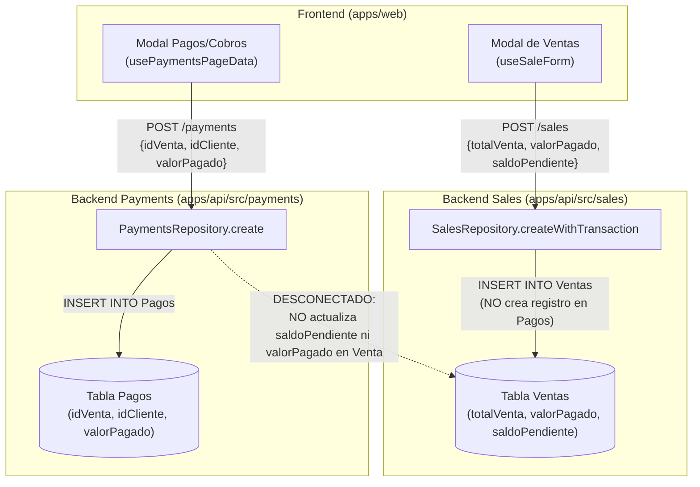

# Auditoría Arquitectural: Cadena Contable Clientes → Ventas → Cartera → Pagos

> **Fecha:** 2026-09-20
> **Ámbito:** `apps/api/prisma/schema.prisma`, `apps/api/src/sales/`, `apps/api/src/payments/`, `apps/web/src/app/commercial/sales/`, `apps/web/src/app/commercial/payments/`
> **Objetivo:** Determinar la fuente de verdad del saldo pendiente, consistencia transaccional y flujo de cartera antes de intervenir el módulo de Pagos y Cobros.

---

## 1. Modelos y Relaciones Clave (Prisma)

En `apps/api/prisma/schema.prisma` existen tres entidades directamente involucradas:

```prisma
model Cliente {
  id            String  @id @default(uuid()) @map("ID_Cliente")
  nombre        String  @map("Nombre_Cliente")
  tipoCliente   String  @map("Tipo_Cliente")
  canal         String  @map("Canal")
  contacto      String? @map("Contacto")
  telefono      String? @map("Telefono")
  direccion     String? @map("Direccion")
  diasCredito   Int     @map("Dias_Credito")
  activo        Boolean @default(true) @map("Activo")
  observaciones String? @map("Observaciones")
  ventas        Venta[]
  pagos         Pago[]

  @@map("Clientes")
}

model Venta {
  id              String         @id @default(uuid()) @map("ID_Venta")
  fechaVenta      DateTime       @map("Fecha_Venta")
  idCliente       String         @map("ID_Cliente")
  cliente         Cliente        @relation(fields: [idCliente], references: [id])
  canalVenta      String         @map("Canal_Venta")
  tipoPago        String         @map("Tipo_Pago")           // "CONTADO" | "CREDITO"
  fechaLimitePago DateTime?      @map("Fecha_Limite_Pago")   // Vencimiento del crédito
  totalVenta      Decimal        @map("Total_Venta") @db.Decimal(12, 2)
  valorPagado     Decimal        @map("Valor_Pagado") @db.Decimal(12, 2)
  saldoPendiente  Decimal        @map("Saldo_Pendiente") @db.Decimal(12, 2)
  estado          String         @map("Estado")              // "COMPLETADO" | "PENDIENTE" | "ANULADA"
  observaciones   String?        @map("Observaciones")
  detalles        DetalleVenta[]
  pagos           Pago[]

  @@map("Ventas")
}

model Pago {
  id            String   @id @default(uuid()) @map("ID_Pago")
  fechaPago     DateTime @map("Fecha_Pago")
  idCliente     String   @map("ID_Cliente")
  cliente       Cliente  @relation(fields: [idCliente], references: [id])
  idVenta       String   @map("ID_Venta")
  venta         Venta    @relation(fields: [idVenta], references: [id])
  valorPagado   Decimal  @map("Valor_Pagado") @db.Decimal(12, 2)
  metodoPago    String   @map("Metodo_Pago")
  referencia    String?  @map("Referencia")
  observaciones String?  @map("Observaciones")

  @@map("Pagos")
}
```

### Cardinalidad
- `Cliente` (1) ── (N) `Venta`
- `Cliente` (1) ── (N) `Pago`
- `Venta` (1) ── (N) `Pago`
- **No existe** tabla separada `CuentaPorCobrar`. La deuda se almacena directamente en la tupla `Venta`.

---

## 2. Diagrama de Flujo Actual



---

## 3. Respuestas a los Objetivos Puntuales

### 1. Entidad de la Deuda
- La deuda vive **desnormalizada directamente en la tabla `Venta`** en las columnas:
  - `totalVenta`
  - `valorPagado`
  - `saldoPendiente`
  - `fechaLimitePago`
- **No existe** tabla `CuentaPorCobrar`.
- El frontend y los listados dependen de la columna `Venta.saldoPendiente` para saber si un cliente tiene deuda.

### 2. Relación Venta ↔ Pago
- El modelo `Pago` tiene claves foráneas hacia **ambas entidades**: `idCliente` (`Cliente`) e `idVenta` (`Venta`).
- El endpoint `POST /payments` exige explícitamente `idVenta` e `idCliente`.

### 3. Flujo de Abono Inicial en Venta
- Cuando una venta se crea con `tipoPago = 'CREDITO'` y un abono inicial (`valorPagado > 0`):
  - El frontend envía `valorPagado`, `saldoPendiente = totalVenta - valorPagado`.
  - El backend `SalesRepository.createWithTransaction` guarda dichos montos en la tabla `Ventas`.
  - **CRÍTICO:** **No se inserta ninguna fila en la tabla `Pagos`** por el abono inicial de la venta. Queda registrado únicamente como valor escalar en la cabecera de la venta.

### 4. Cálculo del Saldo
- **En la creación de la venta:** El saldo es calculado en el frontend dentro del formulario (`totalVenta - valorPagado`) y enviado crudo al backend.
- **Al registrar un pago en `POST /payments`:**
  - `PaymentsRepository.create` se limita a hacer `prisma.pago.create(...)`.
  - **HALLAZGO CRÍTICO:** El backend **no descuenta** `Venta.saldoPendiente` ni incrementa `Venta.valorPagado` al recibir un nuevo pago.
  - El frontend (`usePaymentsPageData.js`) filtra ventas pendientes consultando `s.saldoPendiente > 0`. Como `Venta.saldoPendiente` nunca se actualiza en la base de datos con los pagos posteriores, la venta permanece indefinidamente con su saldo original a menos que se intervenga la tabla `Ventas`.

### 5. Fechas Límite
- Se persiste en `Venta.fechaLimitePago` (`DateTime?`).
- Al registrar un abono en `POST /payments`, no hay campo ni lógica para reprogramar o extender la fecha de vencimiento (`fechaLimitePago`).

---

## 4. Hallazgos Críticos y Riesgos Contables

1. **Riesgo de Inconsistencia y Huérfanos Contables (Doble Verdad):**
   - El historial de pagos en `Pagos` no suma lo mismo que el `valorPagado` de `Ventas`, porque el abono inicial no genera un `Pago`.
   - La tabla `Pagos` solo contiene pagos subsecuentes, perdiéndose la trazabilidad del primer abono o pago de contado si se audita exclusivamente la tabla `Pagos`.
2. **Falta de Transaccionalidad en `PaymentsRepository.create`:**
   - La creación de un pago no está envuelta en una transacción de Prisma (`prisma.$transaction`) que actualice atómicamente `Venta.saldoPendiente` y `Venta.valorPagado`.
   - Si se cancela la totalidad de la deuda mediante pagos, el estado de la venta no muta a `COMPLETADO` / saldo 0 en BD.
3. **Dependencia de Cálculo en Frontend:**
   - Tanto en ventas como en pagos, las validaciones de tope (`valorPagado <= totalVenta`, `pago <= saldoPendiente`) están exclusivamente delegadas a la UI cliente.

---

## 5. Contrato de Integración Recomendado para "Pagos y Cobros"

Para que el rediseño del módulo opere de forma limpia, auditable y sin duplicar lógica:

### A. Transaccionalidad Backend (`PaymentsRepository / PaymentsService`)
Al invocar `POST /payments`:
```typescript
await prisma.$transaction(async (tx) => {
  // 1. Obtener la venta bloqueada para update
  const venta = await tx.venta.findUnique({ where: { id: dto.idVenta } });
  if (!venta) throw new NotFoundException('Venta no encontrada');

  const nuevoValorPagado = Number(venta.valorPagado) + Number(dto.valorPagado);
  const nuevoSaldo = Math.max(0, Number(venta.totalVenta) - nuevoValorPagado);

  // 2. Crear el pago
  const pago = await tx.pago.create({ data: dto });

  // 3. Actualizar el saldo de la venta y su fecha límite si se acuerda prórroga
  await tx.venta.update({
    where: { id: dto.idVenta },
    data: {
      valorPagado: nuevoValorPagado,
      saldoPendiente: nuevoSaldo,
      estado: nuevoSaldo === 0 ? 'COMPLETADO' : venta.estado,
      ...(dto.nuevaFechaLimite ? { fechaLimitePago: new Date(dto.nuevaFechaLimite) } : {})
    }
  });

  return pago;
});
```

### B. Endpoint Especializado de Cartera (`GET /commercial/receivables` o `GET /sales/pending`)
- Retornar consolidado por cliente:
  - `totalFacturado`
  - `totalAbonado`
  - `saldoTotal`
  - Desglose de facturas vencidas vs. por vencer (con cálculo `diasVencido` en backend).
- Evitar que el frontend tenga que descargar todas las ventas históricas (`GET /sales`) para filtrarlas en memoria.
