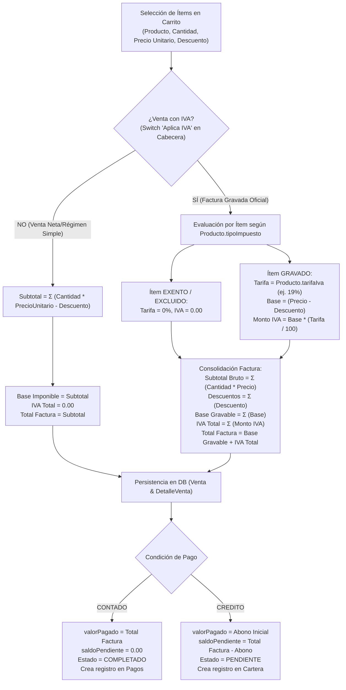

# Auditoría de Impacto Técnico y Tributario: IVA en Catálogo de Productos y Ventas

> **Fecha:** 2026-09-20
> **Ámbito:** `apps/api/prisma/schema.prisma`, `apps/api/src/products/`, `apps/api/src/sales/`, `apps/web/src/app/commercial/sales/`, `apps/web/src/app/commercial/payments/`
> **Objetivo:** Auditar el impacto de incorporar configuración tributaria de IVA en el catálogo de productos y liquidación flexible en ventas, garantizando integridad en Recetas, Inventario, Lotes y Cartera.

---

## 1. Diagnóstico del Esquema Actual vs Requerimiento Fiscal Colombiano

### 1.1 Estado Actual en Productos y Ventas
- **Modelo `Producto`:**
  - Cuenta con `precioVenta`, `margenObjetivo`, `precioMayorista`, `descuentoMayoristaPorcentaje` y `cantidadMinimaMayorista`.
  - **No cuenta** con atributos de IVA (`tarifaIva`, `tipoImpuesto`, `precioIncluyeIva`).
  - Todo precio de venta se asume flat/bruto sin discriminación tributaria.
- **Modelo `Venta` y `DetalleVenta`:**
  - `Venta` solo almacena `totalVenta`, `valorPagado`, `saldoPendiente`, `tipoPago`, `estado`.
  - `DetalleVenta` registra `cantidad`, `precioUnitario`, `descuento`, `totalLinea`, `costoUnitario`, `utilidadUnitaria`, `utilidadTotal`.
  - Falta desglose de base imponible gravada, monto de IVA por ítem y consolidado de impuestos de la factura.
- **Antecedente Homologado en Compras:**
  - El modelo `PrecioProveedor` y `DetalleCompra` ya implementan el estándar tributario de IVA en el backend:
    - `tieneIva` (Boolean, default true)
    - `porcentajeIva` (Decimal, default 19.00)
    - `precioIncluyeIva` (Boolean, default true)
    - `costoBaseSinIva` / `montoIva` / `subtotalSinIva`

### 1.2 Requerimiento Tributario Colombiano (Estatuto Tributario)
- Los productos alimenticios lácteos en Colombia pueden estar:
  - **Excluidos / Exentos:** Leche cruda, ciertos quesos frescos campesinos (tarifa 0%).
  - **Gravados con Tarifa General:** Yogures con aditivos, postres lácteos, bebidas a base de yogur con azúcar añadida (tarifa 19%).
- Los negocios pequeños en régimen simplificado (no responsables de IVA) o transacciones sin requisito de facturación electrónica gravada requieren poder emitir ventas **sin IVA** sin alterar los precios base del catálogo.

---

## 2. Propuesta de Evolución en Esquema Prisma

Para incorporar IVA sin romper productos ni registros históricos:

```prisma
// ----------------------------------------------------
// 1. MODELO PRODUCTO
// ----------------------------------------------------
model Producto {
  // ... campos existentes ...
  precioVenta                  Decimal  @map("Precio_Venta") @db.Decimal(12, 2)
  margenObjetivo               Decimal  @map("Margen_Objetivo") @db.Decimal(5, 2)
  precioMayorista              Decimal? @map("Precio_Mayorista") @db.Decimal(12, 2)

  // ATRIBUTOS TRIBUTARIOS (NUEVOS)
  tipoImpuesto                 String   @default("GRAVADO") @map("Tipo_Impuesto") // "GRAVADO" | "EXENTO" | "EXCLUIDO"
  tarifaIva                    Decimal  @default(19.00) @map("Tarifa_Iva") @db.Decimal(5, 2)
  precioIncluyeIva             Boolean  @default(true) @map("Precio_Incluye_Iva")
  // ... relaciones ...
}

// ----------------------------------------------------
// 2. MODELO VENTA (CABECERA)
// ----------------------------------------------------
model Venta {
  // ... campos existentes ...
  aplicaIva                    Boolean  @default(false) @map("Aplica_Iva")
  subtotal                     Decimal  @default(0) @map("Subtotal") @db.Decimal(12, 2)
  descuentoTotal               Decimal  @default(0) @map("Descuento_Total") @db.Decimal(12, 2)
  baseImponible                Decimal  @default(0) @map("Base_Imponible") @db.Decimal(12, 2)
  ivaTotal                     Decimal  @default(0) @map("Iva_Total") @db.Decimal(12, 2)
  totalVenta                   Decimal  @map("Total_Venta") @db.Decimal(12, 2)
  valorPagado                  Decimal  @map("Valor_Pagado") @db.Decimal(12, 2)
  saldoPendiente               Decimal  @map("Saldo_Pendiente") @db.Decimal(12, 2)
  // ... relaciones ...
}

// ----------------------------------------------------
// 3. MODELO DETALLE VENTA (LÍNEAS)
// ----------------------------------------------------
model DetalleVenta {
  // ... campos existentes ...
  cantidad                     Decimal  @map("Cantidad")
  precioUnitario               Decimal  @map("Precio_Unitario") @db.Decimal(12, 2)
  descuento                    Decimal  @default(0) @map("Descuento") @db.Decimal(12, 2)

  // CAMPOS TRIBUTARIOS DE LÍNEA (NUEVOS)
  tarifaIva                    Decimal  @default(0) @map("Tarifa_Iva") @db.Decimal(5, 2)
  baseGravable                 Decimal  @default(0) @map("Base_Gravable") @db.Decimal(12, 2)
  montoIva                     Decimal  @default(0) @map("Monto_Iva") @db.Decimal(12, 2)

  totalLinea                   Decimal  @map("Total_Linea") @db.Decimal(12, 2)
  costoUnitario                Decimal  @map("Costo_Unitario") @db.Decimal(12, 2)
  utilidadUnitaria             Decimal  @map("Utilidad_Unitaria") @db.Decimal(12, 2)
  utilidadTotal                Decimal  @map("Utilidad_Total") @db.Decimal(12, 2)
}
```

> **Compatibilidad hacia atrás:** Todos los nuevos campos cuentan con `@default(...)`, lo que permite aplicar la migración sin pérdida de datos ni bloqueo de las ventas históricas ya registradas.

---

## 3. Diagrama de Flujo de Liquidación en "Nueva Venta"



---

## 4. Análisis de Afectación Multimódulo

### 4.1 Recetas y Producción (BOM)
- **Diagnóstico:** El costeo de recetas (`apps/api/src/recipes/`) y producción (`apps/api/src/production/`) opera a partir del `costoUnidadBase` o `costoPromedio` de los insumos en inventario.
- **Veredicto:** **CERO AFECTACIÓN**. El costeo técnico de planta (leche, cultivos, fruta, azúcar, envases) se mantiene 100% sobre base neta. El IVA comercial de ventas es un impuesto al valor agregado liquidado sobre el precio final al consumidor, no un costo directo de formulación química o rendimientos de planta.

### 4.2 Inventario de Producto Terminado y Lotes
- **Diagnóstico:**
  - `InventarioProducto.costoPromedio` y `Lote.costoUnitario` se alimentan del costo real de fabricación que arroja la orden de producción.
  - Al realizar una venta, `sales.repository.js` descuenta stock físico (algoritmo FEFO) y extrae `d.costoUnitarioLote` para calcular la utilidad contable (`utilidadTotal = totalLinea - (cantidad * costoUnitario)`).
- **Veredicto:** **INTEGRIDAD PRESERVADA**. El stock en unidades y los movimientos de kardex no sufren alteraciones. Se recomienda que la utilidad neta comercial se calcule descontando el IVA: `Utilidad Real = (Total Línea - Monto IVA) - Costo Total de Producción`.

### 4.3 Cartera, Recaudos y Pagos
- **Diagnóstico:**
  - El motor de Cartera recientemente implementado (`GET /payments/receivables` y `POST /payments`) toma como fuente de verdad `Venta.totalVenta` y `Venta.saldoPendiente`.
- **Veredicto:** **ALINEACIÓN PERFECTA**. Al persistir en `Venta.totalVenta` el monto total a pagar por el cliente (incluyendo IVA cuando aplique), la cartera y los recibos de recaudo reflejan exactamente la suma legal exigible al cliente, manteniendo total trazabilidad de abonos y saldos.

---

## 5. Plan de Implementación Seguro (Paso a Paso)

1. **Fase 1: Migración de Base de Datos (Prisma)**
   - Añadir campos tributarios con defaults seguros en `Producto`, `Venta` y `DetalleVenta`.
   - Ejecutar migración controlada (`prisma migrate dev` o script de alter table).
2. **Fase 2: Catálogo de Productos (UI & API)**
   - Incorporar en el modal de producto selector de `tipoImpuesto` (`GRAVADO`, `EXENTO`, `EXCLUIDO`) y campo numérico de `tarifaIva` (19% por defecto para gravados, 0% para exentos).
3. **Fase 3: Módulo de Ventas (Liquidación Transaccional)**
   - En el frontend (`useSaleForm.js` y `SaleModal.jsx`), agregar switch Poka-Yoke `"Liquidar con IVA"`.
   - Calcular dinámicamente en el formulario el desglose: Subtotal, Base Gravada, IVA (19%) y Total.
   - Actualizar `sales.repository.js` para persistir los nuevos campos tributarios en `DetalleVenta` y cabecera de `Venta`.
4. **Fase 4: Comprobante de Venta e Impresión**
   - Actualizar `InvoiceDetailModal.jsx` para desglosar la columna de IVA y reflejar Subtotal, IVA y Total Factura en el formato impreso.
