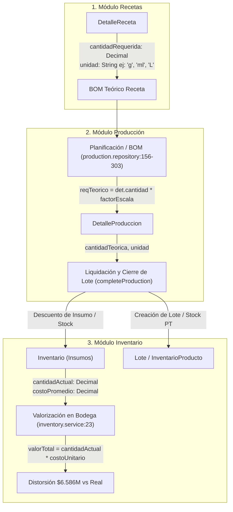

# INFORME DE AUDITORÍA: CADENA DE CUSTODIA DE UNIDADES Y COSTOS
**Módulos Afectados:** Recetas $\rightarrow$ Producción $\rightarrow$ Inventario
**Fecha:** 20 de Septiembre de 2026
**Referencia:** Prompt 524 y Prompt 526

---

## 1. Contexto del Problema y Síntomas Observados

En el módulo de Inventario (`/operations/inventory`), la tarjeta KPI superior **"VALOR EN BODEGA"** reportaba una cifra astronómica e irreal de **$6.586.534.768 COP**, impulsada por insumos individuales desproporcionados, por ejemplo:
- **Insumo:** `YOGUR GRIEGO`
- **Stock en Bodega:** `1.603,333 Gramos` (~1.6 kg)
- **Valorización en Pantalla:** `$36.924.768 COP`
- **Valor Real Esperado:** `~$36.925 COP` (distorsión exacta de $\times 1.000$).

---

## 2. Puntos Exactos de Código Involucrados

- **Archivo Backend:** `apps/api/src/inventory/inventory.service.js` (Líneas 14–37)
- **Línea de Valorización Individual:** Línea 23 (`valorTotal = stockActual * costoUnitario`)
- **Línea de Agregación Global KPI:** Línea 33 (`valorTotalBodega = enriched.reduce(...)`)

```javascript
// apps/api/src/inventory/inventory.service.js
const enriched = data.map(item => {
  let costoUnitario = Number(item.costoPromedio) || 0;
  if (!costoUnitario && item.insumo?.precios?.length > 0) {
    const sortedPrices = [...item.insumo.precios].sort((a, b) => new Date(b.fechaRegistro) - new Date(a.fechaRegistro));
    costoUnitario = Number(sortedPrices[0].costoUnidadBase) || 0;
  }

  const stockActual = Number(item.cantidadActual) || 0;
  const stockMinimo = Number(item.insumo?.stockMinimo) || 0;
  const valorTotal = stockActual * costoUnitario; // <-- DISTORSIÓN: Gramos * Costo de Kilogramo

  let estado = 'OPTIMO';
  if (stockActual <= 0) estado = 'CRITICO';
  else if (stockActual <= stockMinimo) estado = 'BAJO';

  return { ...item, stockActual, stockMinimo, costoUnitario, valorTotal, estado };
});

const metadata = {
  valorTotalBodega: enriched.reduce((acc, curr) => acc + curr.valorTotal, 0), // <-- Inflado a $6.586M
  // ...
};
```

---

## 3. Mapa de Flujo: Receta $\rightarrow$ Producción $\rightarrow$ Inventario



### Detalle de la Cadena de Datos:
1. **Recetas (`DetalleReceta`):** Almacena `cantidadRequerida` (Decimal) y `unidad` (String libre: "Gramos", "g", "Litros", "L", "Unidades", etc.). El esquema de base de datos no cuenta con normalización forzada contra `Insumo.unidadBase`.
2. **Producción (`DetalleProduccion` y `BOM`):** En `apps/api/src/production/production.repository.js` (Líneas 283–303), al consultar insumos regulares para calcular el costo teórico:
   ```javascript
   const inv = await this.prisma.inventario.findUnique({ where: { idInsumo: det.idInsumo } });
   const stockFisico = inv ? Number(inv.cantidadActual) : 0;
   const costoUnitario = price ? Number(price.costoUnidadBase) : Number(inv.costoPromedio);
   const costoTeorico = reqTeorico * costoUnitario;
   ```
   Toma directamente el `stockFisico` y el `costoUnidadBase` sin verificar ni convertir si `det.unidad` (ej. gramos) coincide con la unidad en la que está cotizado el insumo.
3. **Inventario (`inventory.service.js`):** Asume que `costoPromedio` y `costoUnidadBase` corresponden a la misma unidad en la que está expresada `cantidadActual`.

---

## 4. Origen Exacto de la Desconexión de Unidades

La distorsión es producto de dos fallas estructurales combinadas:

1. **Ambigüedad en `PrecioProveedor.costoUnidadBase` vs `Insumo.unidadBase`:**
   - Si un insumo se compra a granel o por kilo (ej. Balde o Bolsa de 1 Kg a $23.000 COP), se persistió en `costoUnidadBase` el valor `$23.000`.
   - Sin embargo, en la tabla `Insumo`, la `unidadBase` quedó registrada como **`Gramos`** (y el inventario físico almacena $1.603,333\text{ g}$).
   - Al realizar la multiplicación sin factor de escala:
     $$1.603,333 \times \$23.030 = \$36.924.768 \quad (\text{debería ser } 1,603\text{ kg} \times \$23.030 = \$36.924)$$
2. **Ausencia de Unidad de Medida en la Tabla `Inventario`:**
   - En `schema.prisma`, el modelo `Inventario` sólo tiene `idInsumo`, `cantidadActual` y `costoPromedio`, delegando la unidad a `Insumo.unidadBase`. No existe trazabilidad explícita de en qué unidad física fue ingresado el lote o la compra.

---

## 5. Recomendación Arquitectural Limpia

1. **Servicio Centralizado de Conversión de Unidades (`UnitConverter`):**
   - Establecer tablas de conversión estándares por magnitud física:
     - **Masa:** `kg` $\leftrightarrow$ `g` $\leftrightarrow$ `mg`
     - **Volumen:** `l` $\leftrightarrow$ `ml` $\leftrightarrow$ `oz`
     - **Discretas:** `und` $\leftrightarrow$ `docena` $\leftrightarrow$ `empaque`
2. **Invariante en Módulo de Compras y Catálogo de Precios:**
   - Al registrar compras o precios de proveedores, calcular y persistir estrictamente:
     $$\text{costoUnidadBase} = \frac{\text{Precio del Empaque}}{\text{Factor de Conversión a Insumo.unidadBase}}$$
   - *Ejemplo:* Si se compran 10 Kg de Yogurt Griego a $230.000 COP y la unidad base del insumo es `g`, el `costoUnidadBase` debe almacenarse como $\$23\text{ COP/g}$.
3. **Normalización en Recetas y Producción:**
   - Al procesar el BOM en `production.repository.js`, convertir `det.cantidadRequerida` a `insumo.unidadBase` antes de contrastar contra `stockActual` o calcular `costoTeorico`.
