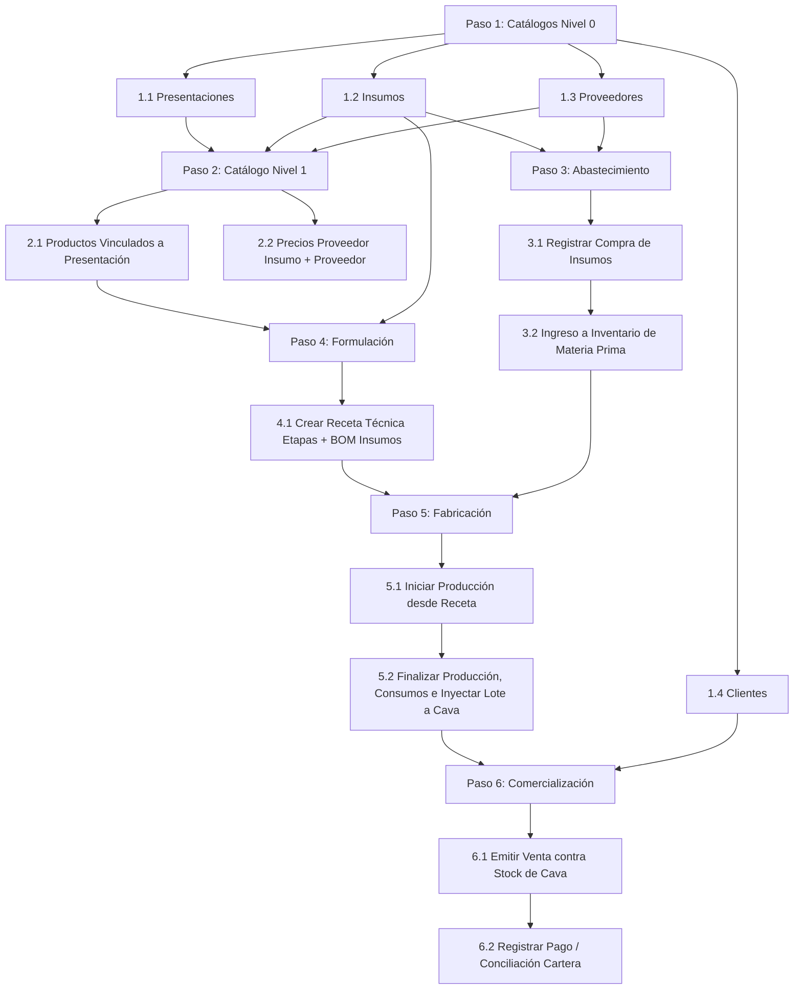

# Auditoría Integral de la Cadena de Valor, Dependencias de Datos y Flujo Operativo

**Fecha de Ejecución:** 13 de Septiembre de 2026  
**Alcance:** Backend (`apps/api/prisma/schema.prisma`), Frontend (`apps/web/src/app/`) y Shell de Navegación.  
**Modo:** Solo lectura / Diagnóstico estructural sin alteración de código.

---

## 1. Matriz Técnica de Dependencias Relacionales (Prisma)

A partir del análisis de integridad referencial, restricciones de clave foránea (`@relation`) y nulabilidad en `schema.prisma`, se definen cuatro niveles jerárquicos estrictos de precedencia:

| Nivel | Entidad | Tabla PostgreSQL | Llaves Foráneas Requeridas (NOT NULL) | Dependencias Previas Obligatorias | Clasificación Operativa |
| :---: | :--- | :--- | :--- | :--- | :--- |
| **0** | **Presentacion** | `Presentaciones` | *Ninguna* | *Ninguna* | Maestra Autónoma (Formatos/Envases) |
| **0** | **Insumo** | `Insumos` | *Ninguna* | *Ninguna* | Maestra Autónoma (Materia Prima/Empaques) |
| **0** | **Proveedor** | `Proveedores` | *Ninguna* | *Ninguna* | Maestra Autónoma (Terceros de Compra) |
| **0** | **Cliente** | `Clientes` | *Ninguna* | *Ninguna* | Maestra Autónoma (Terceros de Venta) |
| **0** | **Gasto** | `Gastos` | *Ninguna* | *Ninguna* | Transaccional Financiera Autónoma |
| **0** | **OrdenCompra** | `Ordenes_Compra` | *Ninguna* | *Ninguna* | Agrupador Pre-Operativo (Carrito/Listas) |
| **1** | **Producto** | `Productos` | `idPresentacion` | `Presentacion` | Ficha Técnica Comercial de Venta |
| **1** | **PrecioProveedor** | `Precios_Proveedores` | `idInsumo`, `idProveedor` | `Insumo`, `Proveedor` | Catálogo de Costos de Adquisición |
| **1** | **Inventario** | `Inventario` | `idInsumo` (Unique 1:1) | `Insumo` | Saldo de Materia Prima en Bodega |
| **1** | **InventarioProducto**| `Inventario_Productos` | `idProducto` (Unique 1:1) | `Producto` | Saldo de Producto Terminado en Cava |
| **1** | **OrdenCompraItem** | `Orden_Compra_Items` | `idOrden` (`idInsumo`/`idProveedor` opcionales) | `OrdenCompra` (e `Insumo`/`Proveedor` recomendado) | Ítem de Lista de Pedido |
| **1** | **Compra** | `Compras` | `idProveedor` (opcional en schema, obligatorio en flujo) | `Proveedor` | Encabezado de Factura de Compra |
| **1** | **DetalleCompra** | `Detalle_Compras` | `idCompra`, `idInsumo` | `Compra`, `Insumo` | Renglón de Ingreso de Materia Prima |
| **2** | **Receta** | `Recetas` | `idProducto` | `Producto` (que ya requiere `Presentacion`) | Estructura Maestra de Fabricación |
| **2** | **EtapaReceta** | `Etapas_Receta` | `idReceta` | `Receta` | Fase del Proceso (Pasteurizado, etc.) |
| **2** | **DetalleReceta** | `Detalle_Recetas` | `idEtapaReceta`, `idInsumo` | `EtapaReceta`, `Insumo` | Lista de Materiales (BOM) por Fase |
| **2** | **Produccion** | `Producciones` | `idProducto` | `Producto`, `Receta` activa con stock de `Insumo` | Orden de Transformación Industrial |
| **2** | **DetalleProduccion**| `Detalle_Producciones` | `idProduccion`, `idInsumo` | `Produccion`, `Insumo` | Consumo Teórico vs Real de Insumos |
| **2** | **Lote** | `Lotes` | `idProduccion` (`idProducto` / `idInsumo` opcionales) | `Produccion`, `Producto` | Trazabilidad Industrial y Fecha Caducidad |
| **3** | **Venta** | `Ventas` | `idCliente` | `Cliente` | Encabezado Comercial de Factura |
| **3** | **DetalleVenta** | `Detalle_Ventas` | `idVenta`, `idProducto` (`idLote` opcional) | `Venta`, `Producto`, `Lote` (con stock disponible) | Renglón de Despacho Comercial |
| **3** | **Pago** | `Pagos` | `idCliente`, `idVenta` | `Cliente`, `Venta` | Conciliación de Cartera / Cobro |
| **3** | **MovimientoInventario**| `Movimientos_Inventario` | Opcionales (`idInsumo`, `idProducto`, `idLote`) | `Insumo` o `Producto` | Kardex Transaccional de Auditoría |

---

## 2. Detección de Puntos Ciegos y Fricciones en Frontend (UI vs Código)

### A. Pantallas Bloqueantes ante Catálogos Vacíos
1. **Creación de Producto (`/catalog/products`):**
   - **Bloqueo:** El selector "Presentación" depende estrictamente del array retornado por `/presentations`. Si no hay presentaciones registradas, el formulario no puede completarse porque `idPresentacion` es obligatorio en el modal y la base de datos (`missingFields.push('Presentación')`). El botón de submit se bloquea permanentemente sin mensaje orientador que indique "Debe crear primero una Presentación en Catálogo".
2. **Creación de Receta Técnica (`/catalog/recipes`):**
   - **Bloqueo doble:**
     - En la cabecera: Requiere seleccionar un `Producto` (`p.id`). Si no hay productos creados, el desplegable está vacío.
     - En el BOM de Etapa (`IngredientsFormSection`): Requiere seleccionar `Insumo`. Si no hay insumos dados de alta, no se puede añadir ningún componente de materia prima a la receta.
3. **Precios de Proveedor (`/catalog/supplier-prices`):**
   - **Bloqueo:** Requiere tanto `Insumo` como `Proveedor`. Si cualquiera de las dos tablas está vacía, no es posible vincular una cotización comercial.
4. **Programación de Producción (`/operations/production`):**
   - **Bloqueo crítico:** El hook `useProductionForm` obtiene recetas de `/recipes`. Si no hay recetas formuladas y aprobadas para el producto, el selector queda en blanco impidiendo generar la orden de producción y la posterior generación de lotes terminados.
5. **Registro de Ventas (`/commercial/sales`):**
   - **Bloqueo por Cava / Stock:** `SaleModal` consulta `/inventory/finished-products` y `/clients`. Si el inventario de producto terminado está en 0 o no hay clientes registrados, el formulario bloquea el botón con la validación `missingFields: ['Cliente', 'Al menos 1 producto en la orden', 'Resolver stock insuficiente']`.
6. **Módulo de Pagos (`/commercial/payments`):**
   - **Bloqueo:** Requiere seleccionar `Cliente` y `Venta`. Si no existe una venta registrada previamente a crédito o pendiente, el selector de facturas se deshabilita o permanece vacío.

### B. Análisis de Atajos Operativos ("Al Vuelo")
- **Compras (`/operations/purchases/new`):**
  - **Ventaja Operativa Detectada:** Es la **única** vista del sistema equipada con modales integrados al vuelo (`usePurchaseModals`: `showProvModal`, `showInsumoModal`), permitiendo al operario crear un Proveedor o un Insumo sin abandonar la pantalla de compra.
- **Productos / Recetas / Ventas / Pagos:**
  - **Fricción Detectada:** No cuentan con atajos de creación al vuelo.
  - En **Productos**, no se puede crear una Presentación desde el modal. Obliga a navegar a `/catalog/presentations`.
  - En **Recetas**, no se puede crear un Insumo ni un Producto desde el modal. Obliga a navegar a `/catalog/products` y `/catalog/supplies`.
  - En **Ventas**, no se puede crear un Cliente ni un Lote/Producto desde el modal. Obliga a ir a `/commercial/clients`.

---

## 3. Secuencia Cronológica Definitiva de Puesta en Marcha (Paso a Paso)

Para arrancar la operación desde una base de datos vacía sin experimentar ningún bloqueo en la interfaz de usuario, se debe cumplir la siguiente secuencia lineal:



### Detalle Operativo y Justificación Técnica
1. **Paso 1: Dar de alta los Maestros Autónomos (Nivel 0)**
   - `Presentaciones`: Formato físico del envase (ej: *Botella PET 1000ml*).
   - `Insumos`: Materia prima e insumos de empaque (ej: *Leche Entera*, *Cultivo Lácteo*, *Azúcar*, *Tapa*).
   - `Proveedores`: Datos fiscales y comerciales de los suministradores.
   - `Clientes`: Directorio de clientes minoristas/mayoristas para despachos.
2. **Paso 2: Formular Catálogos Intermedios (Nivel 1)**
   - `Productos`: Se define la referencia comercial combinando nombre y presentación (ej: *Yogurt Fresa 1000ml* ligada a la presentación del Paso 1).
   - `Precios de Proveedor`: Se vincula cuánto cobra cada proveedor por cada insumo y su unidad base.
3. **Paso 3: Ingreso de Materia Prima al Inventario**
   - Se ejecuta una `Compra` (o recepción de Orden de Compra). Esto alimenta automáticamente la tabla `Inventario` de insumos mediante el trigger o servicio backend.
4. **Paso 4: Creación de la Receta Técnica (BOM)**
   - Se parametriza la `Receta` para el producto del Paso 2, configurando etapas y asignando los insumos del Paso 1 con sus cantidades y mermas teóricas.
5. **Paso 5: Ejecución y Cierre de Producción Industrial**
   - Se genera una orden de `Producción` a partir de la receta. Al finalizarla, se descuenta el stock de insumos (`Inventario`) y se genera el `Lote` en `Inventario_Productos` con stock disponible en cava.
6. **Paso 6: Venta y Recaudo**
   - Con stock disponible en cava y el cliente creado, se registra la `Venta` consumiendo el lote (FEFO).
   - Si la venta tiene saldo pendiente, se concilia en el módulo de `Pagos`.

---

## 4. Especificaciones para el Asistente Onboarding del Header

Para eliminar la desorientación inicial y prevenir errores 400/bloqueos por catálogos vacíos, se especifican las pautas de implementación del asistente interactivo en el `Header`:

### A. Arquitectura y Estado Global (`OnboardingContext`)
- **Endpoint de Diagnóstico Backend (`/api/v1/system/onboarding-status`):**
  Un endpoint ligero y memoizado que retorne el recuento básico de entidades maestras:
  ```json
  {
    "counts": {
      "presentations": 4,
      "supplies": 12,
      "suppliers": 3,
      "products": 2,
      "recipes": 1,
      "suppliesWithStock": 5,
      "finishedProductsWithStock": 2,
      "clients": 1
    },
    "currentStep": 3,
    "completed": false
  }
  ```

### B. Componente UI en el Header (`OnboardingWizardWidget`)
- **Ubicación:** Barra superior (`apps/web/src/components/shell/Header.jsx`), adyacente al selector de listas del carrito.
- **Representación Visual:**
  - **Barra de Progreso Compacta:** Indicador circular o lineal de porcentaje (ej: `Paso 3 de 6: Abastecer Insumos (45%)`).
  - **Menú Desplegable (Dropdown Guía):**
    1. `[✔] 1. Configurar Formatos y Envases` (Presentaciones)
    2. `[✔] 2. Registrar Insumos y Proveedores`
    3. `[➜] 3. Registrar Primera Compra (Ingresar Stock)` *(Resaltado activo con botón "Comprar")*
    4. `[ ] 4. Crear Producto y Receta Técnica`
    5. `[ ] 5. Fabricar Primer Lote (Producción)`
    6. `[ ] 6. Registrar Primera Venta`
  - **Opción de Ocultar/Desactivar:** Una vez completados los pasos, el widget muestra badge de *Operación Lista* y se puede colapsar a un icono de checklist.

### C. Guardas de Navegación Preventivas (Poka-Yoke)
- Si `counts.presentations === 0`, en la pantalla de **Productos** se renderiza un banner informativo amigable en lugar de un formulario con selectores rotos:  
  `"Aviso: Debe registrar al menos una Presentación antes de configurar productos. [Ir a Presentaciones]"`
- Si `counts.products === 0 || counts.supplies === 0`, en **Recetas** se muestra el estado vacío guiado con enlace directo al catálogo faltante.
- Si `counts.recipes === 0`, en **Producción** el botón de nueva orden se deshabilita con tooltip aclaratorio: `"Cree y apruebe una receta técnica antes de programar producción"`.
- Si `counts.finishedProductsWithStock === 0`, en **Ventas** el modal alerta preventivamente: `"Cava vacía: no hay lotes de producto terminado disponibles para facturar"`.

---

## 5. Estado de Verificación del Repositorio

Auditoría realizada estrictamente bajo el protocolo de solo lectura y preservación de código.
- Comando de verificación: `git status --short`
- El repositorio mantiene exactamente el estado previo a la asignación, sin scripts residuales en raíz ni cambios de código en backend o frontend.
