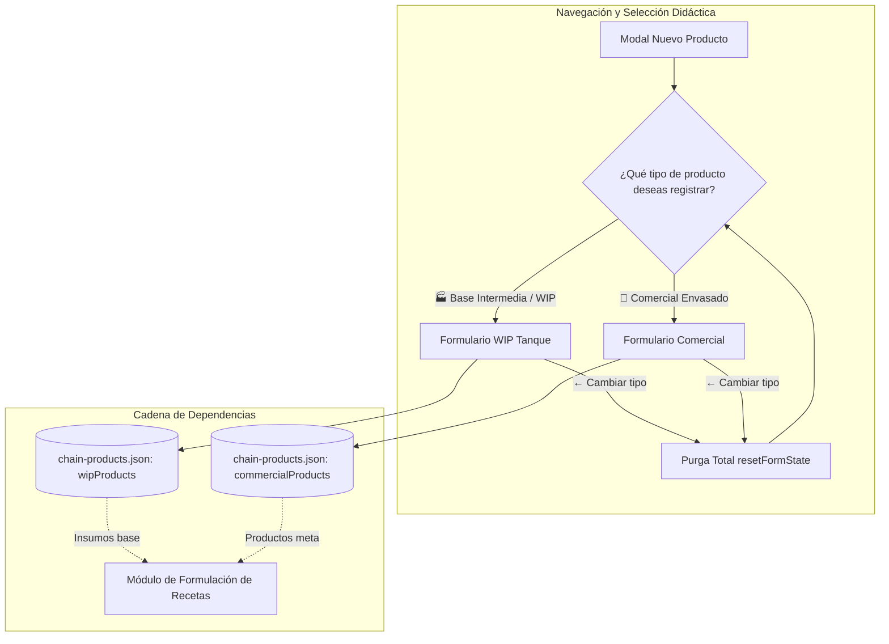
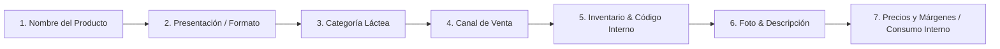

# Flujo de Siembra en Cadena: Productos WIP y Comerciales Reactivos (Seed Chain Flow)

## 1. Visión General y Arquitectura
Este documento describe el protocolo de siembra reactiva en cadena para el catálogo de productos lácteos en **Manna Yogurt**. El flujo vincula las 20 bases intermedias en tanque (WIP / semielaborados) y los 20 productos terminados (Comerciales) a través de la interfaz web `/catalog/products`, garantizando consistencia, reactividad inmediata e idempotencia total contra la base de datos.



---

## 2. Protocolo de Reseteo Integral (Clean Reset)
Al alternar entre modos o presionar el botón interactivo **`← Cambiar tipo`**, el hook `useProductFormState.js` ejecuta `resetFormState(targetType = null)`.

### Matriz de Estado Limpio

| Campo | Estado Limpio WIP (`targetType = 'WIP'`) | Estado Limpio Comercial (`targetType = 'COMERCIAL'`) | Retorno a Tarjetas (`targetType = null`) |
| :--- | :--- | :--- | :--- |
| `nombre` | `''` | `''` | `''` |
| `idPresentacion` | `''` | `''` | `''` |
| `categoria` | `''` | `''` | `''` |
| `canalVenta` | `''` | `''` | `''` |
| `codigo` | `''` | `''` | `''` |
| `unidadVenta` | `'LITRO'` | `'UND'` | `''` |
| `stockMinimo` | `'5'` | `'5'` | `'5'` |
| `precioVenta` | `0` | `''` | `''` |
| `margenObjetivo` | `0` | `''` | `''` |
| `costoEstimado` | `''` | `''` | `''` |
| `tipoImpuesto` | `'GRAVADO'` | `'GRAVADO'` | `'GRAVADO'` |
| `tarifaIva` | `19` | `19` | `19` |
| `precioMayorista` | `''` | `''` | `''` |
| `imagenUrl` | `null` | `null` | `null` |
| `hasSubmitted` | `false` | `false` | `false` |

---

## 3. Cascada Poka-Yoke en la UI

El formulario aplica una secuencia de desbloqueo condicional paso a paso:



1. **Paso 1 (Nombre):** Campo de texto libre en mayúsculas (`UPPERCASE`). Desbloquea la presentación.
2. **Paso 2 (Presentación):** Filtrada dinámicamente según el modo (A granel/balde para WIP vs frascos/botellas para Comercial).
3. **Paso 3 (Categoría):** Opciones contextualizadas (`CATEGORIAS_WIP` vs `CATEGORIAS_COMERCIALES`).
4. **Paso 4 (Canal de Venta):** Canales restringidos (`USO_INTERNO`, `PLANTA` para WIP; `B2B`, `B2C`, `AMBOS` para Comercial).
5. **Paso 5 (Inventario):** Unidad de medida reactiva (`LITRO` vs `UND`) y código generado sugerido (`YOG-FRE-500`).
6. **Paso 6 (Foto/Descripción):** Bloqueados hasta que la identidad básica esté configurada.
7. **Paso 7 (Costeo y Precios):**
   - **En modo WIP:** Tarjeta didáctica explicativa de consumo interno; inputs de venta fijados a 0.
   - **En modo Comercial:** Entradas con formato de moneda COP, cálculo automático de margen real y precio sugerido.

---

## 4. Idempotencia y Resiliencia en Pruebas E2E

Para garantizar que los tests de siembra puedan ejecutarse repetidamente sin colapsar por duplicidad:

1. **Búsqueda reactiva previa:** Antes de crear, la prueba consulta el buscador de la tabla en `/catalog/products`.
2. **Extracción y Reutilización:** Si el registro ya existe, rescata el ID y Código Interno y lo registra con estado `REUTILIZADO`.
3. **Recuperación tras colisión (Fallback):** Si durante la solicitud `POST` ocurre una colisión en backend, la suite intercepta el fallo, navega al catálogo y rescata la entidad sin romper la ejecución (`REUTILIZADO_FALLBACK`).
4. **Exportación de Estado:** El archivo de estado `apps/web/e2e/.test-data/chain-products.json` almacena el mapa de los 40 productos listos para la formulación de recetas.

---

## 5. Verificación de Cumplimiento Arquitectural
- **SRP (Single Responsibility Principle):**
  - `ProductModal.jsx`: $\le 125$ líneas.
  - `useProductFormState.js`: Hook desacoplado.
- **CSS Modules Puro:** Cero estilos inline complejos (`styles.activeModeChangeBtn`, `styles.activeModeBanner`).
- **Verificación Automatizada:**
  ```bash
  pnpm run verify:srp
  ```
